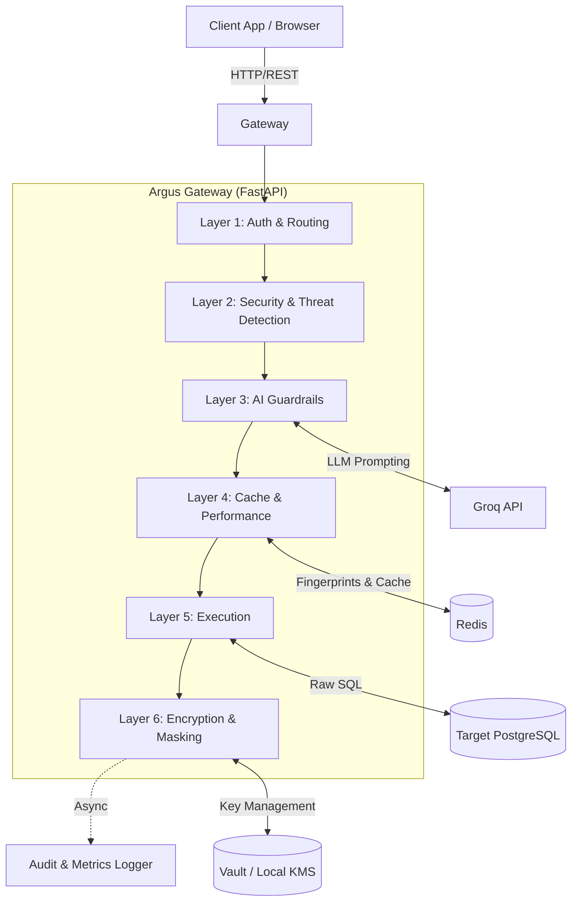
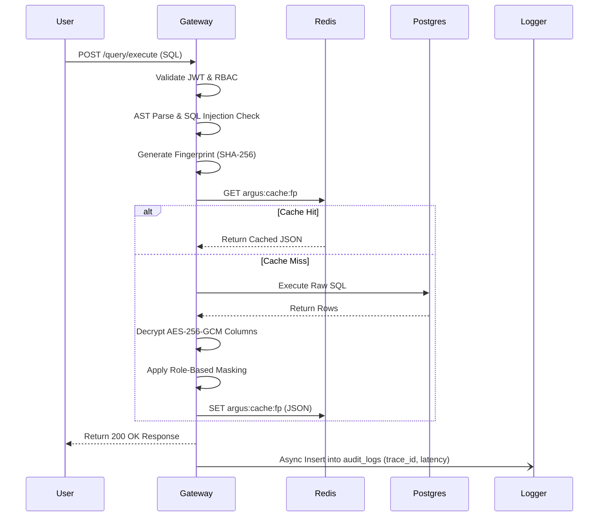
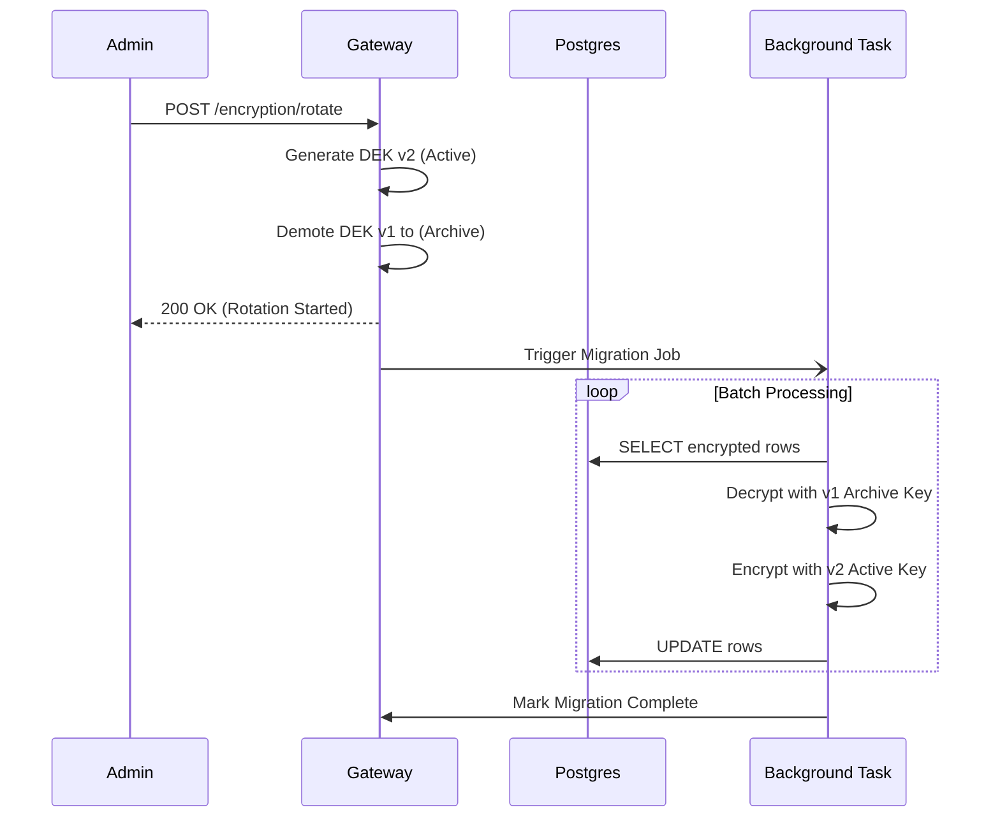
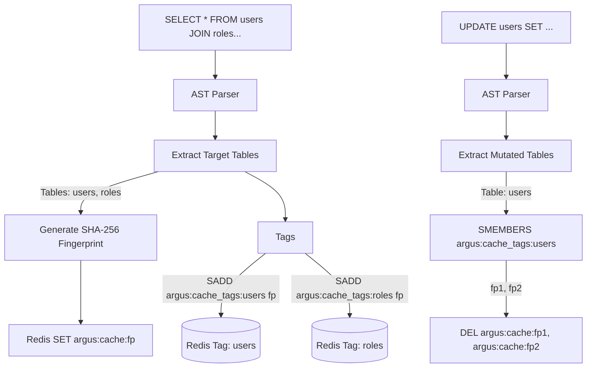
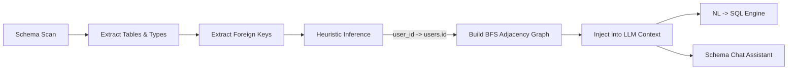

<div align="center">
  
  <h1>Argus — Secure Intelligent Query Gateway</h1>
  <p>A production-ready middleware that sits between your applications and PostgreSQL, providing zero-trust security, intelligent caching, LLM integration, and transparent envelope encryption.</p>

  <!-- Badges -->
  <a href="https://github.com/mmaroof487/SIQG/actions"></a>
  
  
  
  
  
</div>

---

## Why Argus?

Modern applications often struggle with managing database security and performance at scale. When applications directly query PostgreSQL, developers are forced to reinvent the wheel for every service: manually implementing caching layers, building custom Role-Based Access Control (RBAC), auditing queries, encrypting sensitive columns, and defending against SQL injection.

**Argus solves this by centralizing database security and intelligence.** 

Sitting transparently between your API servers and PostgreSQL, Argus intercepts queries and runs them through a rigid 6-layer pipeline. It automatically blocks malicious payloads, serves repeated queries from a Redis cache in under 5ms, applies AES-256-GCM envelope encryption to PII columns, and provides an LLM interface to translate natural language directly into secure SQL.

Instead of fragmenting database logic across dozens of microservices, you route queries through Argus.

---

## Key Features

Argus is designed as a comprehensive gateway. Its capabilities are separated into six core pillars:

### Security
* **SQL Injection Protection**: AST-based parsing blocks dangerous operators and unauthorized mutations.
* **Honeypot Detection**: Automatically bans IP addresses that attempt to query fake/decoy tables.
* **Rate Limiting**: Sliding window rate limits strictly enforced via Redis.
* **JWT Authentication**: Short-lived access tokens with secure HttpOnly cookie management.
* **Granular RBAC**: Role-based access preventing readonly users from mutating data.
* **Column Masking**: Automatically redacts sensitive columns (e.g., passwords, SSNs) for non-admin roles.
* **Audit Logging**: Asynchronous tracking of every query executed, including execution plans and latency.

### Performance
* **Query Fingerprinting**: SHA-256 deterministic hashing of AST trees to identify identical queries.
* **Redis Cache**: Serves repeated queries in under 5ms without touching PostgreSQL.
* **Table-tagged Invalidation**: Mutations (`INSERT`/`UPDATE`) automatically invalidate cache entries tied to the affected tables.
* **Circuit Breaker**: Automatically fails fast if the downstream PostgreSQL instance is unresponsive.
* **Query Cost Estimation**: Dry-runs `EXPLAIN` to reject massively expensive queries before execution.
* **Auto LIMIT Injection**: Ensures rogue `SELECT *` queries cannot OOM the gateway.

### AI Integration
* **Natural Language → SQL**: Translates human questions into accurate Postgres dialects using Groq LLMs.
* **AI Schema Chat**: Conversational interface to explore database tables and relationships.
* **Schema Intelligence**: Extracts schema metadata and maintains a graph of Foreign Key relationships.
* **Suggested Questions**: AI-generated starter questions tailored to the active database schema.
* **FK Inference**: Synthetically deduces missing relationships using column heuristics.

### Data Protection
* **Envelope Encryption**: Two-tier Master/KEK/DEK hierarchy for data-at-rest protection.
* **AES-256-GCM**: Cryptographically secure, authenticated symmetric encryption.
* **Live DEK Rotation**: Allows key rotation with zero downtime.
* **Background Migration Jobs**: Asynchronously re-encrypts historical rows when keys are rotated.
* **Encryption Audit Logs**: Cryptographic operations are durably logged for SOC2/PCI-DSS compliance.
* **PII Scanner**: AI agent that scans schemas to identify unencrypted Personally Identifiable Information.

### Observability
* **Real-time Metrics**: Tracks cache hit ratios, RPM, and latency percentiles.
* **Deep Health Checks**: Validates primary/replica Postgres instances and Redis connectivity.
* **Prometheus Integration**: Exposes unauthenticated `/metrics/live` endpoint.
* **Asynchronous Audit Logs**: Fire-and-forget logging to avoid impacting critical path latency.
* **Heatmaps**: Tracks frequently accessed tables for database indexing optimization.
* **Slow Query Analytics**: Automatically flags queries exceeding the 200ms threshold.

### Frontend (React UI)
* **Admin Dashboard**: High-level overview of system metrics and uptime.
* **Query Studio**: Integrated Monaco editor for writing SQL, testing execution plans, and viewing results.
* **Schema Explorer**: Interactive node-based visualization (React Flow) of database tables.
* **Security Center**: Manage envelope encryption policies, IP whitelists, and honeypot bans.
* **Connections Manager**: Connect and manage multiple external PostgreSQL databases.
* **Observability Panel**: Searchable interface for the global audit trail.

---

## Architecture

Argus is built on a high-throughput async Python backend (FastAPI) and a modern React frontend. It acts as a reverse-proxy for database connections.


```mermaid
graph TD
    Client["Client App / Browser"] -->|HTTP/REST| Gateway
    
    subgraph Argus["Argus Gateway (FastAPI)"]
        direction TB
        Auth["Layer 1: Auth & Routing"]
        Sec["Layer 2: Security & Threat Detection"]
        AI["Layer 3: AI Guardrails"]
        Perf["Layer 4: Cache & Performance"]
        Exec["Layer 5: Execution"]
        Crypto["Layer 6: Encryption & Masking"]
        
        Auth --> Sec
        Sec --> AI
        AI --> Perf
        Perf --> Exec
        Exec --> Crypto
    end

    Gateway --> Auth
    Crypto -.->|Async| Audit["Audit & Metrics Logger"]
    
    Perf <-->|Fingerprints & Cache| Redis[(Redis)]
    Exec <-->|Raw SQL| Postgres[(Target PostgreSQL)]
    Crypto <-->|Key Management| KMS[(Vault / Local KMS)]
    AI <-->|LLM Prompting| Groq[Groq API]
```

---

## Request Lifecycle

When a client submits a SQL query to Argus, the request traverses a strict 6-layer middleware pipeline. If any layer rejects the query, execution halts immediately.

1. **Authentication Layer**: Validates the JWT Bearer token, assigns a unique `trace_id`, and determines the user's RBAC role.
2. **Security Layer**: Parses the SQL into an Abstract Syntax Tree (AST). Rejects unauthorized `DROP` or `TRUNCATE` commands. Checks the IP against the blocklist and honeypot traps.
3. **AI Layer**: Analyzes the query for prompt injection or malicious intent if generated via NL-to-SQL.
4. **Performance Layer**: Hashes the AST to create a `query_fingerprint`. Checks Redis for a cached result. If a cache hit occurs, returns immediately (bypassing layers 5 and 6).
5. **Execution Layer**: If the cache misses, the query is executed against the target PostgreSQL database using async SQLAlchemy.
6. **Decryption & Masking Layer**: Analyzes the `SELECT` results. Transparently decrypts AES-256-GCM columns using active Data Encryption Keys (DEKs). Applies RBAC column masking (e.g., `***@***.com`) based on the user's role.

---

## Query Execution Pipeline


```mermaid
sequenceDiagram
    participant User
    participant Gateway
    participant Redis
    participant Postgres
    participant Logger

    User->>Gateway: POST /query/execute (SQL)
    
    %% Auth & Security
    Gateway->>Gateway: Validate JWT & RBAC
    Gateway->>Gateway: AST Parse & SQL Injection Check
    
    %% Caching
    Gateway->>Gateway: Generate Fingerprint (SHA-256)
    Gateway->>Redis: GET argus:cache:fp
    
    alt Cache Hit
        Redis-->>Gateway: Return Cached JSON
    else Cache Miss
        %% Execution
        Gateway->>Postgres: Execute Raw SQL
        Postgres-->>Gateway: Return Rows
        
        %% Post-Processing
        Gateway->>Gateway: Decrypt AES-256-GCM Columns
        Gateway->>Gateway: Apply Role-Based Masking
        
        %% Cache Update
        Gateway->>Redis: SET argus:cache:fp (JSON)
    end
    
    Gateway-->>User: Return 200 OK Response
    
    %% Async Audit
    Gateway-)Logger: Async Insert into audit_logs (trace_id, latency)
```

---

## Encryption Architecture

Argus implements strict **Envelope Encryption** to secure data at rest while maintaining high throughput.

1. **Master Key**: Provisioned via environment variables or external KMS. Encrypts the Key Encryption Key.
2. **Key Encryption Key (KEK)**: Stored in the database. Used exclusively to wrap and unwrap DEKs.
3. **Data Encryption Key (DEK)**: Unique AES-256-GCM keys generated per column policy.

### Key Rotation & Migration

Argus supports live key rotation with zero downtime.


```mermaid
sequenceDiagram
    participant Admin
    participant Gateway
    participant DB as Postgres
    participant Worker as Background Task

    Admin->>Gateway: POST /encryption/rotate
    Gateway->>Gateway: Generate DEK v2 (Active)
    Gateway->>Gateway: Demote DEK v1 to (Archive)
    Gateway-->>Admin: 200 OK (Rotation Started)
    
    Gateway-)Worker: Trigger Migration Job
    
    loop Batch Processing
        Worker->>DB: SELECT encrypted rows
        Worker->>Worker: Decrypt with v1 Archive Key
        Worker->>Worker: Encrypt with v2 Active Key
        Worker->>DB: UPDATE rows
    end
    
    Worker->>Gateway: Mark Migration Complete
```

---

## Cache Architecture

Argus guarantees cache coherence using a Table-Tagging eviction strategy.


```mermaid
graph TD
    Query["SELECT * FROM users JOIN roles..."] --> AST[AST Parser]
    AST --> Extract[Extract Target Tables]
    Extract --> |Tables: users, roles| Fingerprint[Generate SHA-256 Fingerprint]
    
    Fingerprint --> RedisSet[Redis SET argus:cache:fp]
    
    Extract --> Tags
    Tags --> |SADD argus:cache_tags:users fp| RedisTags1[(Redis Tag: users)]
    Tags --> |SADD argus:cache_tags:roles fp| RedisTags2[(Redis Tag: roles)]
    
    Mutation["UPDATE users SET ..."] --> MutAST[AST Parser]
    MutAST --> ExtractMut[Extract Mutated Tables]
    ExtractMut --> |Table: users| SMEMBERS[SMEMBERS argus:cache_tags:users]
    SMEMBERS --> |fp1, fp2| DEL[DEL argus:cache:fp1, argus:cache:fp2]
```

---

## Schema Intelligence

Argus goes beyond basic schema extraction by constructing a relational graph of your database.


```mermaid
graph LR
    Scan[Schema Scan] --> Extract[Extract Tables & Types]
    Extract --> FK[Extract Foreign Keys]
    FK --> Heuristics[Heuristic Inference]
    Heuristics --> |"user_id -> users.id"| Graph[Build BFS Adjacency Graph]
    
    Graph --> AIContext[Inject into LLM Context]
    AIContext --> NL2SQL[NL -> SQL Engine]
    AIContext --> Chat[Schema Chat Assistant]
```

---


## Tech Stack

Argus utilizes modern, battle-tested technologies.

| Domain | Technologies |
| :--- | :--- |
| **Backend** | Python 3.11, FastAPI, SQLAlchemy, Alembic |
| **Frontend** | React 18, TypeScript, Vite, TailwindCSS, React Flow, Recharts |
| **Infrastructure** | PostgreSQL (Metadata & Target), Redis (Cache & Limits), Docker |
| **Security** | Cryptography (AES-256-GCM), PyJWT, Passlib, SQLGlot |
| **AI Integration** | Groq API (`llama-3.1-8b-instant`), Pydantic Output Parsers |
| **Testing** | Pytest, Locust (Load Testing), Bash (E2E Integration) |
| **DevOps** | Docker Compose, GitHub Actions, Make |

---

## Project Structure

```text
SIQG/
├── gateway/                 # Python FastAPI Backend
│   ├── main.py              # Application entrypoint
│   ├── routers/             # API Endpoint Definitions
│   ├── middleware/          # The 6-Layer Pipeline
│   ├── models/              # SQLAlchemy Database Models
│   └── services/            # Core business logic (AI, Encryption)
├── frontend-ts/             # React TypeScript Frontend
│   ├── src/
│   │   ├── components/      # UI Blocks (Dashboard, Graphs)
│   │   ├── pages/           # Routed Views
│   │   └── utils/           # Axios Client, Auth State
├── tests/                   # Pytest suite & Locust load tests
├── scripts/                 # Bash scripts (E2E tests, CLI demo)
├── sdk/                     # Python Client SDK for Argus
└── docs/                    # Architectural markdown documentation
```

---

## Quick Start

### 1. Running with Docker (Recommended)

Argus is designed to be spun up instantly using Docker Compose. This starts the Gateway, the React UI, the Metadata Postgres DB, a Mock Target DB, and Redis.

```bash
git clone https://github.com/mmaroof487/SIQG.git
cd SIQG

# Copy example environment variables
cp gateway/.env.example gateway/.env
cp frontend-ts/.env.example frontend-ts/.env

# Build and start the cluster
docker compose up --build -d
```

* **Frontend UI**: `http://localhost:3000`
* **API Gateway**: `http://localhost:8000/api/v1`
* **API Docs**: `http://localhost:8000/docs`

> [!NOTE]
> The default admin credentials are `admin` / `admin`.

### 2. Manual Installation

If you prefer to run services bare-metal:

```bash
# Terminal 1: Backend
cd gateway
python -m venv venv
source venv/bin/activate
pip install -r requirements.txt
alembic upgrade head
uvicorn main:app --host 0.0.0.0 --port 8000 --reload

# Terminal 2: Frontend
cd frontend-ts
npm install
npm run dev
```

---

## Testing

Argus maintains a high standard of reliability with comprehensive test suites.

**Unit & Integration Tests (Pytest)**
```bash
cd gateway
pytest tests/ -v --cov=.
```

**End-to-End Tests (Bash)**
```bash
# Validates the entire pipeline from the outside
./test_all_32_features.sh
```

**Stress & Load Tests (Locust)**
```bash
# Requires a running cluster
locust -f tests/load/locustfile.py --headless -u 50 -r 10 -t 1m
```

---

## Performance

Argus is built to be invisible. Because of the aggressive Redis caching and compiled C-extensions for cryptography, the gateway overhead is minimal.

*Tested on a standard consumer workstation using `tests/load/simple_load_test.py`.*

| Operation | Avg Latency | P95 Latency | P99 Latency | Throughput |
| :--- | :---: | :---: | :---: | :---: |
| **Cached Query (Cache Hit)** | 3.55 ms | 5.2 ms | 7.1 ms | 2,500+ RPM |
| **Live Query (Cache Miss)** | 14.27 ms | 28.55 ms | 33.73 ms | DB Bound |
| **API Health Check** | 12.5 ms | 15.6 ms | 28.9 ms | 4,000+ RPM |
| **NL → SQL LLM Translation** | 850 ms | 1.2 s | 2.1 s | API Bound |

### Encryption Overhead
Applying Envelope Encryption (AES-256-GCM) to a result set of 1,000 rows adds approximately **4 milliseconds** of latency to the request (0.004 ms per row). 

---

## Security Features Deep Dive

Argus acts as an impenetrable shield for your database.

1. **AST Validation**: Argus uses `sqlglot` to parse incoming SQL strings into an Abstract Syntax Tree. This allows the gateway to definitively block `DROP`, `TRUNCATE`, or `ALTER` statements before they ever reach the database, completely neutralizing SQL injection.
2. **Honeypot Traps**: You can configure decoy tables (e.g., `wp_users`). If an IP attempts to query a honeypot, Argus instantly bans the IP and drops the connection.
3. **Dynamic Masking**: Argus evaluates the user's role on the fly. If a `readonly` user queries a sensitive column, Argus transparently replaces the data with `***@***.com` before returning the JSON response.
4. **Circuit Breaking**: To prevent cascading failures, Argus tracks consecutive database errors. If the threshold is exceeded, Argus trips the breaker and instantly returns 503s to protect the backend.

---

## Documentation

Argus's architecture is fully documented. Dive deep into specific subsystems:

* **[System Architecture](docs/ARCHITECTURE.md)**: 6-layer component breakdown.
* **[Envelope Encryption](docs/ENCRYPTION.md)**: DEK/KEK management and live migration.
* **[Request Pipeline](docs/REQUEST_FLOW.md)**: Lifecycle of a query.
* **[Caching Subsystem](docs/CACHE.md)**: Redis strategies and invalidation.
* **[Security Posture](docs/SECURITY.md)**: Honeypots, RBAC, and rate limiters.
* **[Schema Intelligence](docs/SCHEMA_INTELLIGENCE.md)**: Graph BFS routing.
* **[AI Integration](docs/AI.md)**: LLM prompts and deterministic fallbacks.
* **[Observability](docs/OBSERVABILITY.md)**: Metrics, async auditing, heatmaps.
* **[API Reference](docs/API.md)**: Complete endpoint specifications.
* **[Benchmarks](docs/BENCHMARKS.md)**: Load-testing results.
* **[Deployment](docs/DEPLOYMENT.md)**: Production readiness checklist.
* **[Data Models](docs/diagram/datamodels.md)**: ER diagrams.

---

## Roadmap

### Completed
- [x] Layer 1-3: Security, AST Parsing, and Caching Pipelines
- [x] Layer 4: Execution Engine & Multi-DB support
- [x] React Frontend: Dashboard, Schema Explorer, Query Studio
- [x] Envelope Encryption & Background DEK Migration
- [x] NL-to-SQL LLM integration & AI Guardrails

### In Progress
- [ ] Automated Cache Warming (predictive pre-fetching)
- [ ] Support for MySQL and SQLite connections

### Future
- [ ] Data-Loss Prevention (DLP) Export Controls
- [ ] Advanced Query Cost Billing and Stripe Integration

---

## Why This Project?

Argus was built to demonstrate advanced proficiency in backend engineering, distributed systems, and production security. 

It tackles the real-world complexity of **middleware design**:
* **Database Engineering**: Safely parsing SQL, understanding execution plans, and managing connections.
* **Security**: Implementing cryptography (AES-GCM), key rotation, and zero-trust principles.
* **Distributed Systems**: Ensuring cache coherence between PostgreSQL mutations and Redis, while handling circuit breaking and async tasks.
* **Observability**: Designing systems that track every metric without adding latency to the critical execution path.
* **AI Integration**: Bridging deterministic software engineering with non-deterministic LLMs using strict schema context injection.

---

## Contributing

We welcome contributions! 

1. Fork the repository
2. Create a feature branch (`git checkout -b feature/amazing-feature`)
3. Ensure all tests pass (`pytest tests/`)
4. Commit your changes (`git commit -m 'feat: add amazing feature'`)
5. Push to the branch (`git push origin feature/amazing-feature`)
6. Open a Pull Request

---

<div align="center">
  <i>Built with precision by <a href="https://github.com/mmaroof487">mmaroof487</a></i>
</div>