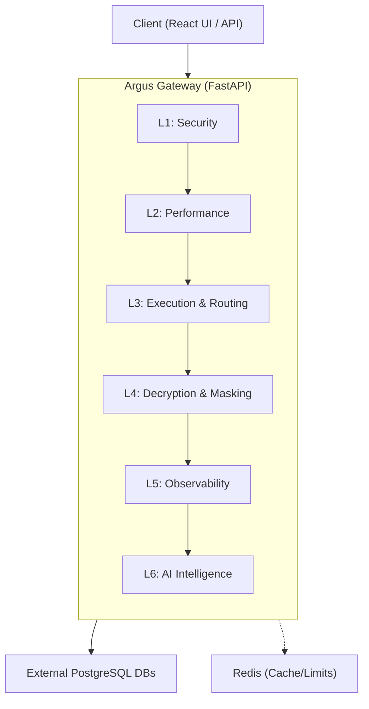

# rgus — Secure Intelligent Query Gateway

[](https://github.com/mmaroof487/SIQG/actions/workflows/ci.yml)


Argus is a **complete, production-ready SQL intelligence and security gateway**. 

Sitting between your applications and your PostgreSQL databases, Argus acts as an intelligent firewall. It intercepts raw SQL, blocks malicious attacks, caches results to improve speed by up to 10x, applies envelope encryption to sensitive data at rest, and provides LLM-powered natural language schema querying.

---

## 🌟 Key Features

* **Zero-Trust Security**: SQL injection blocking, automatic honeypot bans, and per-user IP whitelisting.
* **Envelope Encryption**: Transparent, column-level AES-256-GCM encryption for PII with live key rotation.
* **Intelligent Caching**: Role-scoped query fingerprinting and caching, delivering 6-10x latency improvements.
* **Granular RBAC**: Strict rate limiting, query budgeting, and dynamic column masking (e.g., hiding emails).
* **AI Integration**: Convert natural language to SQL, chat with your schema, and detect anomalies using Groq LLMs.
* **React Dashboard**: A complete UI offering a Query Workbench, Schema Explorer, Security Center, and Live Metrics.

## 📐 Architecture

Argus is constructed as a 6-layer middleware pipeline. Every query is rigorously analyzed, executed, and audited without crashing the host application.


```mermaid
graph TB
    CLIENT["Client (React UI / API)"] --> GATEWAY
    
    subgraph GATEWAY["Argus Gateway (FastAPI)"]
        direction TB
        L1["L1: Security"] --> L2["L2: Performance"]
        L2 --> L3["L3: Execution & Routing"]
        L3 --> L4["L4: Decryption & Masking"]
        L4 --> L5["L5: Observability"]
        L5 --> L6["L6: AI Intelligence"]
    end
    
    GATEWAY --> DB["External PostgreSQL DBs"]
    GATEWAY -.-> REDIS["Redis (Cache/Limits)"]
```
*(For an in-depth breakdown of these layers, see [Architecture](docs/ARCHITECTURE.md))*

## 📸 Interface Screenshots

* **Dashboard**: [docs/assets/dashboard.png]
* **Schema Explorer**: [docs/assets/schema-explorer.png]
* **Query Studio**: [docs/assets/query-studio.png]
* **Security Center**: [docs/assets/security-center.png]

*(Note: Replace placeholder paths with actual screenshots)*

## 🛠️ Tech Stack

* **Backend**: Python 3.11, FastAPI, SQLAlchemy, Alembic, Cryptography
* **Frontend**: React, TypeScript, Vite, TailwindCSS, React Flow, Monaco Editor
* **Infrastructure**: PostgreSQL, Redis, Docker, Docker Compose
* **AI Provider**: Groq (`llama-3.1-8b-instant`)

## 🚀 Quick Start

Ensure you have Docker and Docker Compose v2 installed.

```bash
git clone https://github.com/mmaroof487/SIQG.git
cd SIQG

# Start the Gateway, Postgres, Redis, and React UI
docker compose up --build -d
```

1. **Access the UI**: Open `http://localhost:3000`
2. **Access the API**: Available at `http://localhost:8000/api/v1`

## 📚 Documentation Directory

Argus has grown into a comprehensive system. Dive deep into the specific architecture and workflows using the documentation links below:

* 🏛️ **[System Architecture](docs/ARCHITECTURE.md)**: Detailed component overview.
* 🌊 **[Request Pipeline](docs/REQUEST_FLOW.md)**: Step-by-step walkthrough of a query lifecycle.
* 🔒 **[Security Posture](docs/SECURITY.md)**: Honeypots, RBAC, Masking, and rate limiters.
* 🛡️ **[Envelope Encryption](docs/ENCRYPTION.md)**: AES-256-GCM, DEK/KEK management, and live migration.
* 🧠 **[Schema Intelligence](docs/SCHEMA_INTELLIGENCE.md)**: AI metadata inference and BFS graph routing.
* 🤖 **[AI Integration](docs/AI.md)**: Prompts, guardrails, and Mock LLM fallbacks.
* ⚡ **[Caching Subsystem](docs/CACHE.md)**: Redis strategies and cache invalidation flows.
* 📊 **[Observability](docs/OBSERVABILITY.md)**: Async auditing, heatmaps, and Prometheus metrics.
* 🌐 **[API Reference](docs/API.md)**: Complete endpoint documentation.
* 📈 **[Benchmarks](docs/BENCHMARKS.md)**: Latency and load-testing results.
* 🏗️ **[Deployment](docs/DEPLOYMENT.md)**: Production readiness checklist.
* 🗄️ **[Data Models](docs/diagram/datamodels.md)**: ER diagrams.

## 🏎️ Benchmark Summary

Argus adds minimal overhead. Based on our [Benchmarks](docs/BENCHMARKS.md), running AES-256-GCM encryption on a 1,000-row result set adds approximately **4ms** to the total request. The system sustains **74 req/s** with sub-30ms P95 latency during load testing.

## 🗺️ Roadmap

- [x] Phase 1-4: Core Gateway (Security, Cache, Execution)
- [x] Phase 5: Multi-DB connections and React Workbench
- [x] Phase 6: Envelope Encryption and PII scanning
- [ ] Phase 7: Automated Cache Warming
- [ ] Phase 8: Data-Loss Prevention (DLP) Export Controls

---
*Built by [mmaroof487](https://github.com/mmaroof487) • Licensed under MIT.*