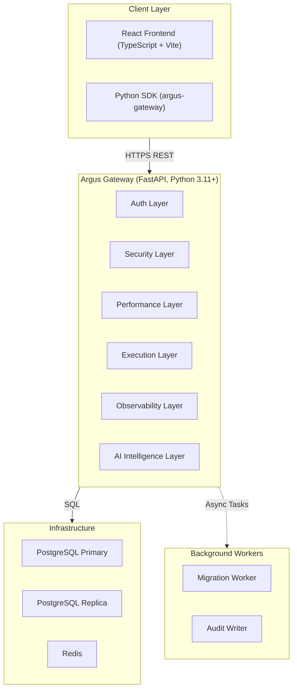

# System Architecture

Argus is a production-grade SQL intelligence gateway with a 6-layer pipeline covering security, performance, execution, observability, hardening, and AI.

## High-Level Architecture

## Component Responsibilities

### Backend Layers
The backend is structured into 6 distinct middleware layers. Each request flows through these sequentially.

1. **Auth Layer**: Validates JWTs, API keys, generates trace IDs.
2. **Security Layer**: IP filtering, honeypot detection, SQL injection blocking, sensitive column guards.
3. **Performance Layer**: Rate limiting, time-based RBAC, API key scope checks, query fingerprinting, caching, cost estimation.
4. **Execution Layer**: Circuit breakers, read/write routing, timeout handling, column decryption, RBAC masking.
5. **Observability Layer**: Async audit logging, metrics tracking, table heatmap updates.
6. **AI Intelligence Layer**: Natural language to SQL, query explaining, schema chatting, anomaly detection.

### Frontend Layers
The frontend is a React application built with TypeScript and Vite. It provides:
- **Query Workbench**: Monaco editor for writing SQL.
- **Multi-DB Connection Manager**: Manage external PostgreSQL connections.
- **Dashboard**: Live metrics, system health, query heatmap.
- **Security Center**: Admin tools to manage IP rules, view audit logs, and whitelist queries.
- **Schema Explorer**: React Flow-based visual schema browsing.

### Redis
Redis is heavily utilized for:
- Caching query results (with role-scoped prefixes).
- Sliding-window rate limiting.
- Circuit breaker state management.
- Real-time metrics counters.
- Brute-force detection counters.

### PostgreSQL
- **Primary**: Handles all write operations and stores Argus configuration (users, connections, policies).
- **Replica**: Handles all read operations for better scalability.

### LLM
- Primary integration with **Groq** (`llama-3.1-8b-instant`).
- Fallback to a **Mock LLM** pattern-based generator to ensure zero-downtime if the upstream API fails.

### Encryption Subsystem
Envelope encryption is used to secure sensitive data:
- **Master Key**: Secures the Key Encryption Key (KEK).
- **KEK**: Stored in a Key Provider (Vault, Env, File) and encrypts Data Encryption Keys (DEKs).
- **DEK**: Unique per connection/table, encrypts actual column data using AES-256-GCM.

### Background Workers
- **Migration Worker**: Handles batch encryption/decryption of historical data when keys are rotated.
- **Audit Writer**: Asynchronously writes audit logs to the database to prevent blocking the main request thread.
