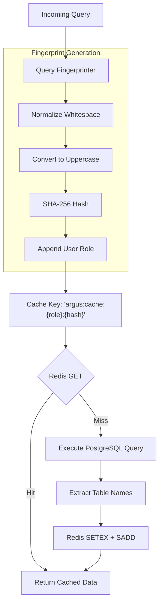
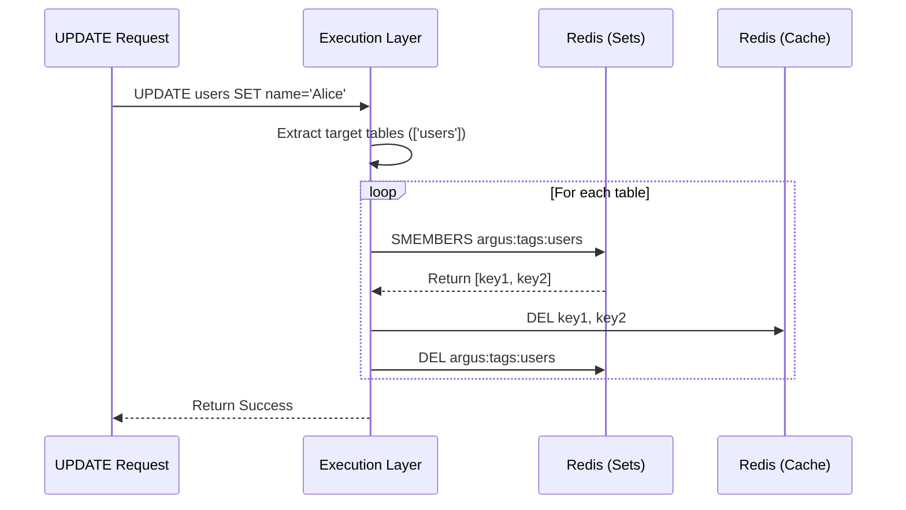

# Caching Subsystem

Argus implements a highly intelligent, role-scoped caching layer built on Redis. This layer accelerates repeated `SELECT` queries by 6-10x while maintaining strict isolation between user permissions.

## Architecture

## Features

### 1. Query Fingerprinting
A query fingerprint ensures that identical queries execute from cache regardless of trivial differences:
- **Normalization**: Multiple spaces and tabs are collapsed.
- **Capitalization**: `select id from users` and `SELECT id FROM users` produce the same fingerprint.
- **Role Scoping**: The fingerprint is concatenated with the user's role (e.g., `admin`, `readonly`). This guarantees that a restricted user cannot access cached results generated by an admin.

### 2. Table Tagging & Cache Invalidation
When an `INSERT`, `UPDATE`, or `DELETE` occurs, Argus intelligently invalidates only the cached queries that depend on the modified tables.

### 3. Redis Layout
The cache uses the following key structures in Redis:

- `argus:cache:{role}:{hash}`: Stores the JSON payload of the query results. Configurable TTL (default: 3600 seconds).
- `argus:tags:{table_name}`: A Redis SET containing all cache keys that depend on `{table_name}`.

### 4. Cache Statistics
Argus automatically tracks caching efficiency. The `/api/v1/metrics/live` endpoint aggregates these counters:
- `argus:metrics:cache_hit`
- `argus:metrics:cache_miss`

Cache hit ratio is calculated on the dashboard as `hits / (hits + misses)`.

### 5. Future Capabilities (Cache Warming)
To ensure consistent P99 latency on application startup, Argus is designed to support cache warming, where historical high-frequency query fingerprints can be asynchronously executed and re-populated into Redis via background workers.
