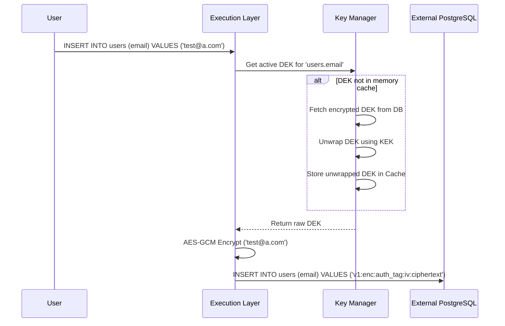
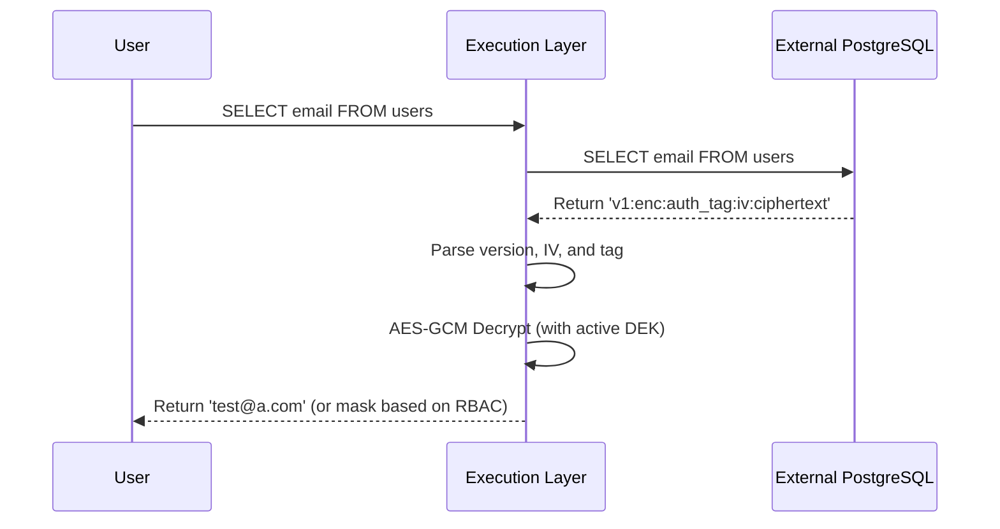
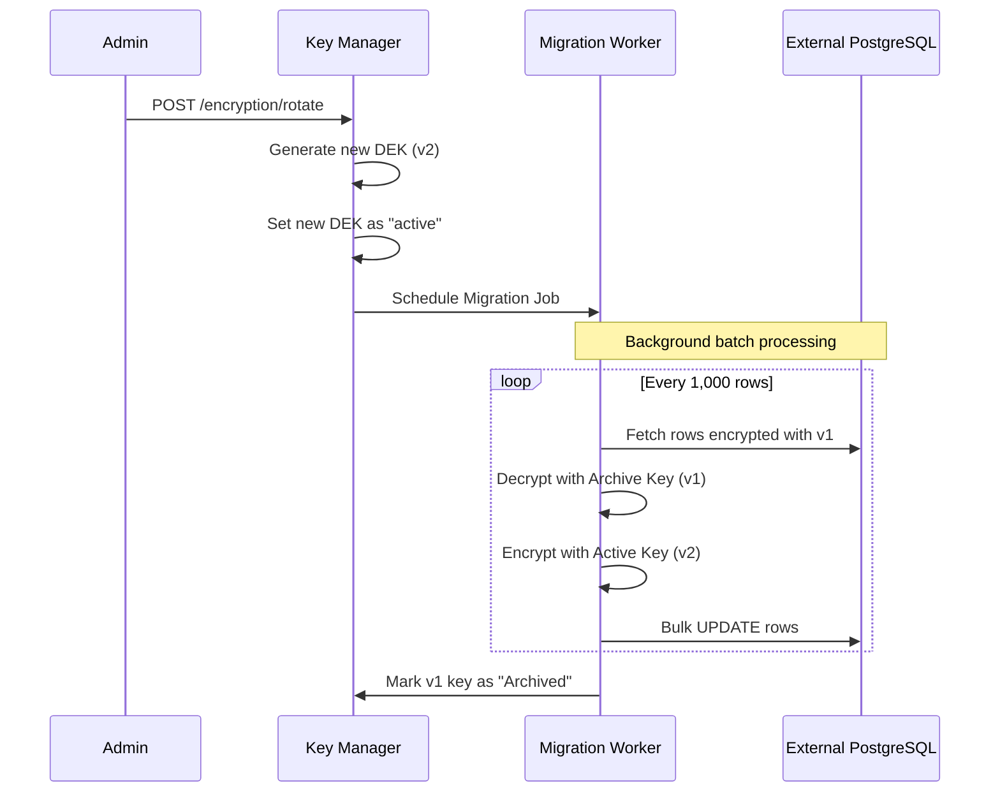

# Envelope Encryption Subsystem

Argus provides transparent, column-level AES-256-GCM encryption for connected databases, ensuring that sensitive Personally Identifiable Information (PII) is completely encrypted at rest.

## Why Envelope Encryption?
Standard encryption directly uses a single master key to encrypt data. Envelope encryption instead uses a hierarchy of keys.
- **Improved Performance**: Generating local, symmetric keys is faster than sending all data to an external KMS for encryption.
- **Granular Blast Radius**: If a key is compromised, it only affects a specific table or column, rather than the entire database.
- **Simplified Key Rotation**: You can rotate the Master Key by just re-encrypting the KEKs, rather than re-encrypting terabytes of database rows.

## Key Hierarchy

1. **Master Key**: This is the root of trust, injected via an environment variable (`siqg_master_key_123...`) or fetched from an external Vault. It encrypts the KEK.
2. **Key Encryption Key (KEK)**: Stored in the Argus metadata database. It is used to encrypt the DEKs.
3. **Data Encryption Key (DEK)**: A unique AES-256 key generated per connection/table. DEKs are stored in the `dek_history` table (encrypted by the KEK).
4. **Active DEK Cache**: Argus caches unwrapped (decrypted) DEKs in memory for 15 minutes to allow for <1ms symmetric encryption of database rows during queries.

## Flows

### 1. Data Encryption (INSERT / UPDATE)
When an `INSERT` query hits Argus, it is intercepted before reaching the database.

### 2. Data Decryption (SELECT)
Argus automatically unwraps the payload format (`v1:enc:...`) upon reading results.

## Key Rotation and Migration

To meet compliance requirements (e.g., SOC2, PCI-DSS), Argus supports live key rotation. 

1. **Active Key**: All new writes immediately use the new key (v2).
2. **Archive Key**: The old key (v1) is retained in memory solely to decrypt existing rows during `SELECT` queries until migration is complete.
3. **Migration Job**: A background task automatically re-encrypts historical data.

## Failure Handling and Recovery
- **Key Loss**: If the Master Key is lost, all KEKs and DEKs are unrecoverable. The `encryption_benchmark.txt` and system logs will alert on boot if the Master Key fails to unwrap the KEK.
- **Transaction Rollbacks**: DEK generation is tied to the Argus PostgreSQL metadata database. If creating a new key fails, the transaction rolls back, and data continues using the existing DEK.

## Audit Logging
Every cryptographic operation (Key creation, DEK unwrapping, Rotation, Migration success/failure) is durably recorded in the `encryption_audit_logs` table for compliance tracking.
