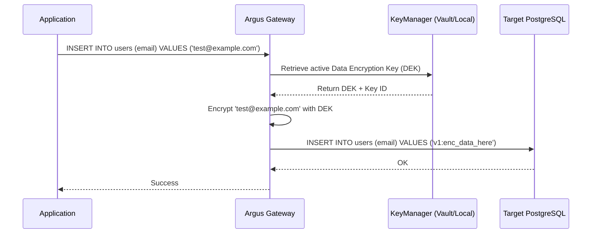

# Argus Encryption Subsystem Guide

Argus provides transparent, column-level AES-256-GCM encryption for connected databases.

## Architecture



## Key Rotation
Argus supports live key rotation. When a new key is provisioned:
1. The new key becomes the **Active Key** for all new writes.
2. The old key is retained as an **Archive Key** to decrypt existing data.
3. The background **Migration Worker** scans encrypted columns and re-encrypts old data with the new active key in batches.

## Usage
Encryption rules are applied to specific columns via the API:
`POST /api/v1/connections/{id}/encryption`
```json
{
  "schema_name": "public",
  "table_name": "users",
  "column_name": "email",
  "classification_method": 3,
  "is_encrypted": true
}
```

Argus will automatically intercept queries reading or writing to `public.users.email` and handle cryptographic operations transparently.
