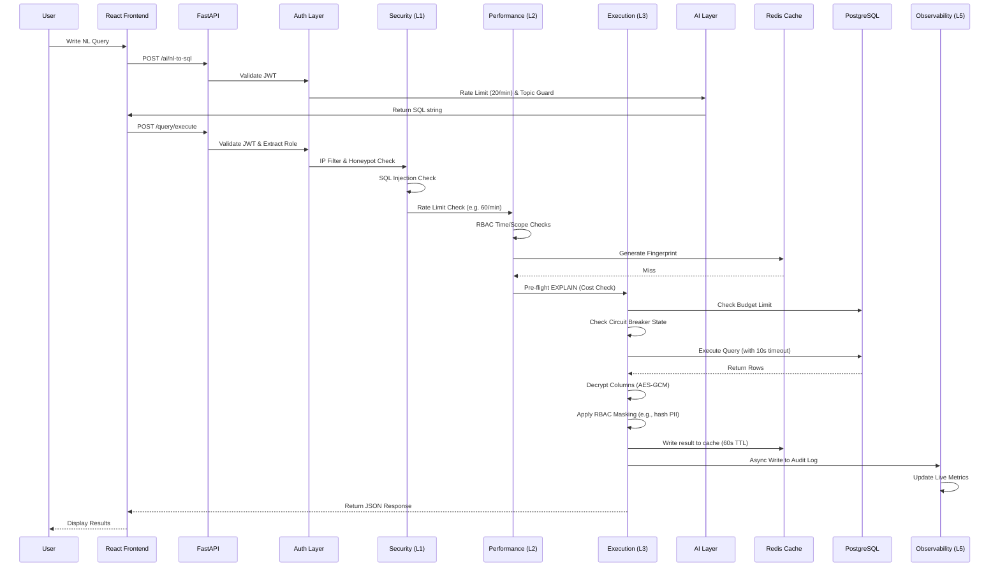

# Request Pipeline

This document walks through the entire lifecycle of a request flowing through the Argus Gateway. The system is designed as a series of 6 middleware layers, ensuring that requests are fully validated, authorized, and tracked before they ever reach the database.

## Example Request Lifecycle

The following demonstrates a complete query request passing through every system layer.

### Detailed Layer Breakdown

#### 1. React Frontend
- The user initiates an action, such as executing a query or chatting with the schema.
- The React application attaches the user's JWT and an `X-Timestamp` / `X-Signature` HMAC for payload verification.

#### 2. Auth Layer
- **JWT Validation**: Ensures the token is valid, hasn't expired, and the user is `is_active`.
- **Trace ID**: A unique `uuid` is assigned to the request for distributed tracing across logs.

#### 3. Security Layer (L1)
- **Rate Limiting**: Enforces strict role-based buckets (e.g., Admin: 500/min, Readonly: 60/min).
- **RBAC**: Ensures the user has permissions for the target tables.
- **SQL Validation**: Blocks `DROP`, `TRUNCATE`, and queries targeting sensitive columns like `hashed_password` directly.
- **Honeypot**: If decoy tables are accessed, the IP is instantly banned.

#### 4. Performance Layer (L2)
- **Fingerprinting**: Whitespace is normalized and a SHA-256 hash of the query is generated.
- **Cache Lookup**: Looks up the fingerprint in Redis.
- **Budgeting**: Runs `EXPLAIN` to estimate query cost before it executes.

#### 5. Execution Layer (L3)
- **Circuit Breaker**: Skips execution if the DB is marked as `open` due to repeated failures.
- **Query Execution**: Routes `SELECT` to replicas and `INSERT`/`UPDATE` to primary databases.
- **Decryption**: Envelope decryption is applied to securely decrypt any masked column values using AES-256-GCM.

#### 6. Observability Layer (L5)
- **Audit Logging**: Asynchronously logs the trace ID, user ID, execution time, and query fingerprint.
- **Metrics**: Updates Prometheus counters and Redis heatmaps.
