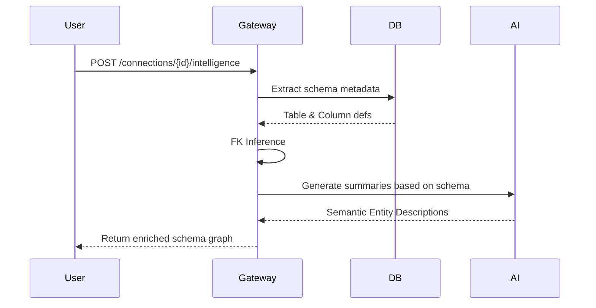

# Schema Intelligence

The Schema Intelligence module powers the Argus React Flow schema browser and the natural language query features. It transforms raw database schemas into semantic, navigable graphs.

## Core Capabilities

### 1. Foreign Key (FK) Extraction & Inference
Argus reads `information_schema` to identify explicit foreign keys. However, for legacy or unoptimized databases that lack explicit FK constraints, Argus uses **Heuristic FK Inference**.

- Identifies columns matching patterns like `user_id` -> `users.id`.
- Assigns a **Confidence Level** (e.g., 90% for exact name match, 60% for partial match) to visually distinguish inferred relationships from strict database constraints.

### 2. BFS Join Explorer
The React Flow frontend requires paths to connect disparate tables. If a user wants to join `payments` and `users`, the backend uses a Breadth-First Search (BFS) algorithm to traverse the foreign key graph and generate the optimal SQL `JOIN` path.

### 3. AI Summaries & Data Insights
Argus passes the metadata (column names, types, constraints) of the schema to the Groq LLM to generate semantic insights.

- **Domain Categorization**: The LLM analyzes the tables (e.g., `orders`, `customers`, `products`) and identifies the schema as an "E-Commerce Database".
- **Suggested Questions**: The LLM suggests natural language queries the user can ask, such as *"What is the total revenue by product category?"*

### 4. Semantic Search
The Schema Explorer UI features a deep search that matches on both exact table/column names and semantic concepts generated by the AI summaries.
