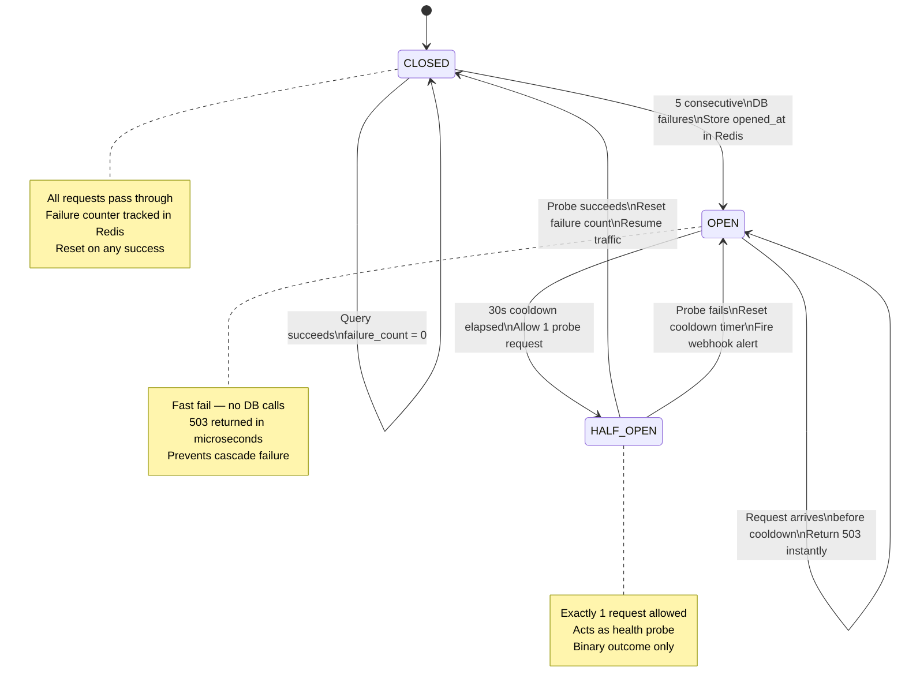

# Circuit Breaker — Resilience Pattern (Phase 2-6)

## Overview

3-state state machine that prevents cascading database failures by fast-failing requests when the database becomes unavailable.

**Scope:** Implemented in Phase 2, unchanged through Phase 6.

**Phase Integration:**

- Activated in the Execution Layer (after performance checks, before DB calls)
- See [systemarchitecture.md](systemarchitecture.md) Layer 3 for context

---

