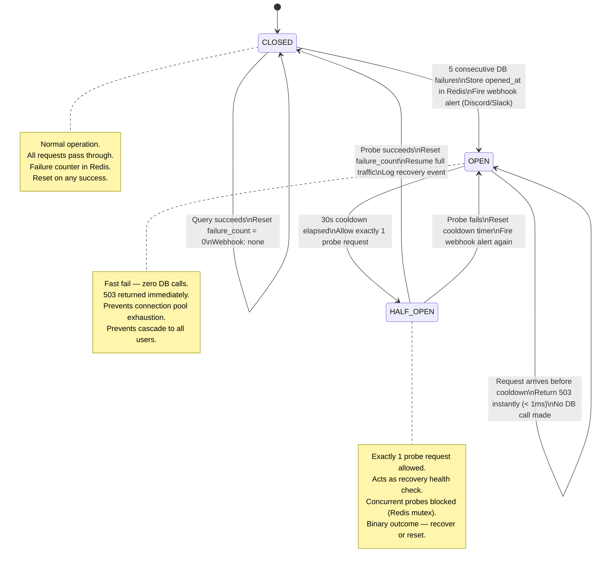

# Circuit Breaker — Resilience Pattern (Execution Layer)

## Overview

3-state state machine that prevents cascading database failures by fast-failing requests when the target database becomes unavailable. Applies to both the primary/replica PostgreSQL pool and external per-user database connections registered via the multi-DB workbench.

**Scope:** Execution Layer — after all security/performance checks, immediately before the database call.

**Config:**
```env
CIRCUIT_FAILURE_THRESHOLD=5   # consecutive failures to open
CIRCUIT_COOLDOWN_SECONDS=30   # time before probe attempt
```

**State stored in Redis:** `argus:circuit:{label}` (one key per DB connection label)

---


```mermaid
stateDiagram-v2
    [*] --> CLOSED

    CLOSED --> CLOSED : Query succeeds\nReset failure_count = 0\nWebhook: none

    CLOSED --> OPEN : 5 consecutive DB failures\nStore opened_at in Redis\nFire webhook alert (Discord/Slack)

    OPEN --> OPEN : Request arrives before cooldown\nReturn 503 instantly (< 1ms)\nNo DB call made

    OPEN --> HALF_OPEN : 30s cooldown elapsed\nAllow exactly 1 probe request

    HALF_OPEN --> CLOSED : Probe succeeds\nReset failure_count\nResume full traffic\nLog recovery event

    HALF_OPEN --> OPEN : Probe fails\nReset cooldown timer\nFire webhook alert again

    note right of CLOSED
        Normal operation.
        All requests pass through.
        Failure counter in Redis.
        Reset on any success.
    end note

    note right of OPEN
        Fast fail — zero DB calls.
        503 returned immediately.
        Prevents connection pool exhaustion.
        Prevents cascade to all users.
    end note

    note right of HALF_OPEN
        Exactly 1 probe request allowed.
        Acts as recovery health check.
        Concurrent probes blocked (Redis mutex).
        Binary outcome — recover or reset.
    end note
```

---

## Integration Points

| Point | Detail |
|-------|--------|
| Checked | After budget/cost check, before query execution |
| Per-connection | Each `connection_id` has its own breaker state in Redis |
| Primary pool | `argus:circuit:primary` |
| Replica pool | `argus:circuit:replica` |
| External DBs | `argus:circuit:{connection_id}` |
| Webhook alert | Fired on `CLOSED → OPEN` and on `HALF_OPEN → OPEN` transitions |
| Metric counter | `argus:metrics:circuit_open_count` incremented on trip |

---

## Retry Policy (within CLOSED state)

Before the circuit breaker trips, transient errors trigger automatic retries with exponential backoff:

```
Attempt 1: immediately
Attempt 2: +100ms
Attempt 3: +200ms
Attempt 4: +400ms
(then fail — circuit failure counter +1)
```

Total max wait before failure counted: ~700ms (within 5s query timeout).

---

_Last Updated: June 2026_
