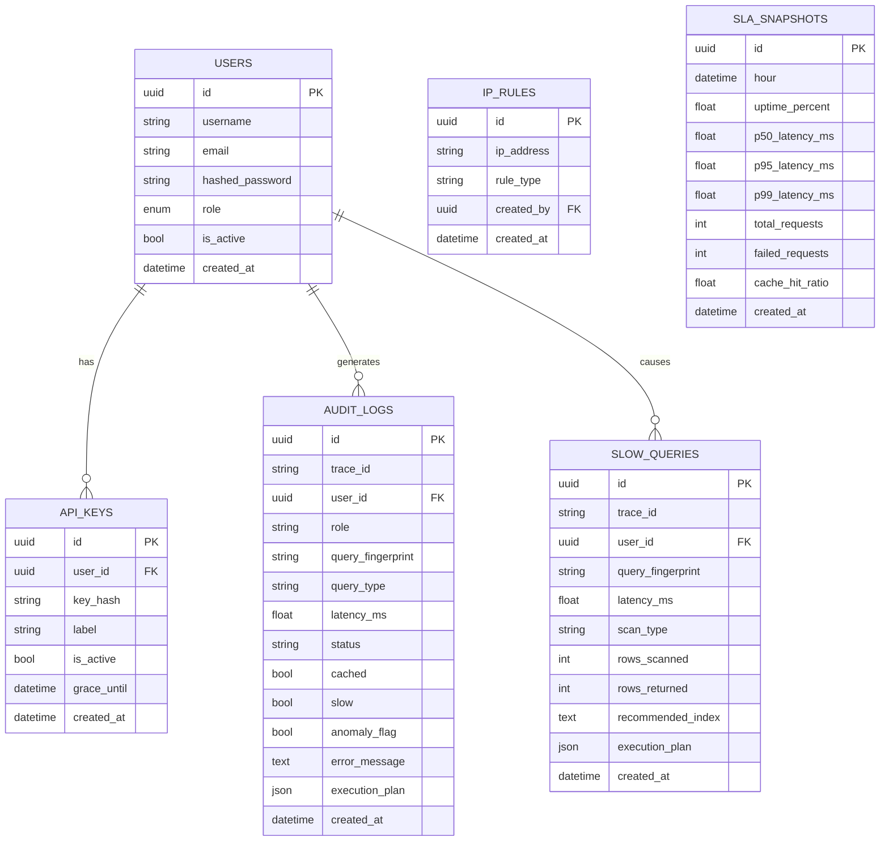

# Data Models — Persistent Storage (Phase 1-6)

## Overview

Core PostgreSQL data models for user management, API keys, rules, audit trails, and SLA tracking.

**Scope:** These models are unchanged across all 6 phases.

**Phase 6 Notes:**

- No new database tables added in Phase 6
- AI features (NL→SQL, Explainer) are stateless endpoints
- All trace data flows through existing `audit_logs` table

---

