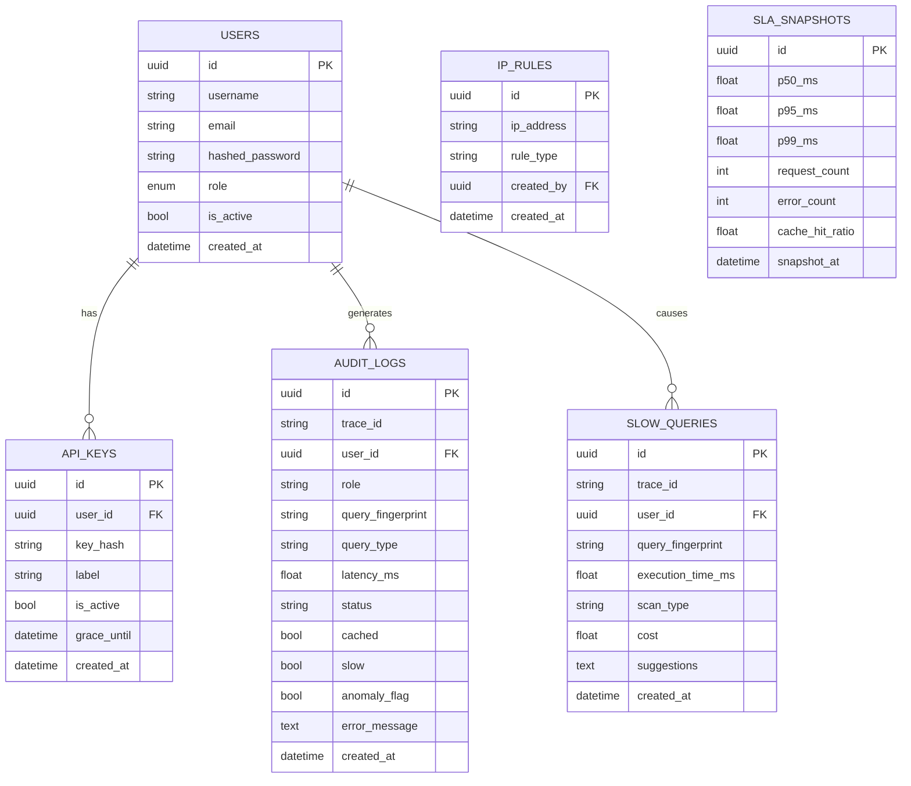

```mermaid
erDiagram
    USERS {
        uuid id PK
        string username
        string email
        string hashed_password
        enum role
        bool is_active
        datetime created_at
    }

    API_KEYS {
        uuid id PK
        uuid user_id FK
        string key_hash
        string label
        bool is_active
        datetime grace_until
        datetime created_at
    }

    IP_RULES {
        uuid id PK
        string ip_address
        string rule_type
        uuid created_by FK
        datetime created_at
    }

    AUDIT_LOGS {
        uuid id PK
        string trace_id
        uuid user_id FK
        string role
        string query_fingerprint
        string query_type
        float latency_ms
        string status
        bool cached
        bool slow
        bool anomaly_flag
        text error_message
        datetime created_at
    }

    SLOW_QUERIES {
        uuid id PK
        string trace_id
        uuid user_id FK
        string query_fingerprint
        float execution_time_ms
        string scan_type
        float cost
        text suggestions
        datetime created_at
    }

    SLA_SNAPSHOTS {
        uuid id PK
        float p50_ms
        float p95_ms
        float p99_ms
        int request_count
        int error_count
        float cache_hit_ratio
        datetime snapshot_at
    }

    USERS ||--o{ API_KEYS : "has"
    USERS ||--o{ AUDIT_LOGS : "generates"
    USERS ||--o{ SLOW_QUERIES : "causes"
```