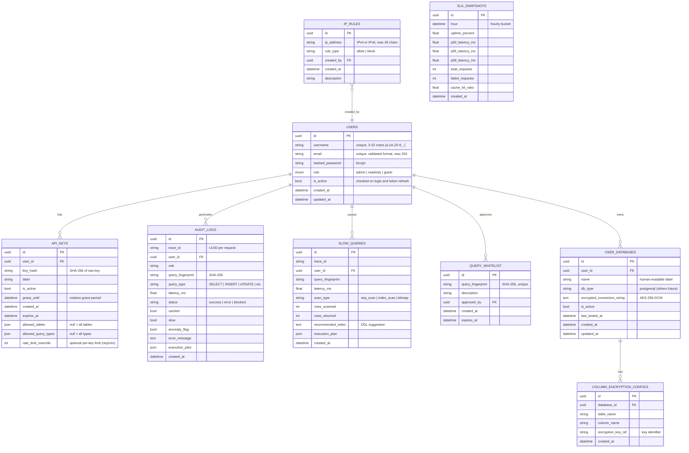

# Data Models — Persistent Storage

## Overview

All PostgreSQL data models used by Argus. Covers user management, API keys, IP rules, multi-DB workbench connections, audit trails, slow query log, SLA snapshots, and query whitelist.

**Notes:**
- AI features (NL→SQL, explain, insights, schema chat, anomaly explain) are **stateless** — no DB models needed
- AI rate limiting uses **Redis** only (`argus:ai_ratelimit:{user_id}:{bucket}`)
- Time-based RBAC, HMAC signing, compliance reports use existing models
- Multi-DB workbench adds two new tables: `user_databases` and `column_encryption_configs`

---

```mermaid
erDiagram
    USERS {
        uuid id PK
        string username "unique, 3-32 chars [a-zA-Z0-9_-]"
        string email "unique, validated format, max 254"
        string hashed_password "bcrypt"
        enum role "admin | readonly | guest"
        bool is_active "checked on login and token refresh"
        datetime created_at
        datetime updated_at
    }

    API_KEYS {
        uuid id PK
        uuid user_id FK
        string key_hash "SHA-256 of raw key"
        string label
        bool is_active
        datetime grace_until "rotation grace period"
        datetime created_at
        datetime expires_at
        json allowed_tables "null = all tables"
        json allowed_query_types "null = all types"
        int rate_limit_override "optional per-key limit (req/min)"
    }

    IP_RULES {
        uuid id PK
        string ip_address "IPv4 or IPv6, max 45 chars"
        string rule_type "allow | block"
        uuid created_by FK
        datetime created_at
        string description
    }

    AUDIT_LOGS {
        uuid id PK
        string trace_id "UUID per request"
        uuid user_id FK
        string role
        string query_fingerprint "SHA-256"
        string query_type "SELECT | INSERT | UPDATE | etc"
        float latency_ms
        string status "success | error | blocked"
        bool cached
        bool slow
        bool anomaly_flag
        text error_message
        json execution_plan
        datetime created_at
    }

    SLOW_QUERIES {
        uuid id PK
        string trace_id
        uuid user_id FK
        string query_fingerprint
        float latency_ms
        string scan_type "seq_scan | index_scan | bitmap"
        int rows_scanned
        int rows_returned
        text recommended_index "DDL suggestion"
        json execution_plan
        datetime created_at
    }

    SLA_SNAPSHOTS {
        uuid id PK
        datetime hour "hourly bucket"
        float uptime_percent
        float p50_latency_ms
        float p95_latency_ms
        float p99_latency_ms
        int total_requests
        int failed_requests
        float cache_hit_ratio
        datetime created_at
    }

    QUERY_WHITELIST {
        uuid id PK
        string query_fingerprint "SHA-256, unique"
        string description
        uuid approved_by FK
        datetime created_at
        datetime expires_at
    }

    USER_DATABASES {
        uuid id PK
        uuid user_id FK
        string name "human-readable label"
        string db_type "postgresql (others future)"
        text encrypted_connection_string "AES-256-GCM"
        bool is_active
        datetime last_tested_at
        datetime created_at
        datetime updated_at
    }

    COLUMN_ENCRYPTION_CONFIGS {
        uuid id PK
        uuid database_id FK
        string table_name
        string column_name
        string encryption_key_ref "key identifier"
        datetime created_at
    }

    USERS ||--o{ API_KEYS : "has"
    USERS ||--o{ AUDIT_LOGS : "generates"
    USERS ||--o{ SLOW_QUERIES : "causes"
    USERS ||--o{ USER_DATABASES : "owns"
    USERS ||--o{ QUERY_WHITELIST : "approves"
    IP_RULES }o--|| USERS : "created_by"
    USER_DATABASES ||--o{ COLUMN_ENCRYPTION_CONFIGS : "has"
```

---

## Redis Keys (Non-Persistent)

| Key Pattern | Type | Purpose | TTL |
|-------------|------|---------|-----|
| `argus:cache:{conn_scope}:{fp}:{role}` | string | Query result cache | 60s (configurable) |
| `argus:cache_tags:{conn_scope}:{table}` | set | Cache tag → fingerprints | TTL-based eviction |
| `argus:intelligence:{conn_id}:{schema_hash}` | json | AI Schema Intelligence cache | 86400s (24h) |
| `argus:ratelimit:{user_id}:{bucket}` | int | Per-role sliding window rate limit | 2× window (120s) |
| `argus:ai_ratelimit:{user_id}:{bucket}` | int | AI-specific rate limit (20/min) | 2× window (120s) |
| `argus:brute:{ip}:{username}` | int | Failed login counter | 15 min |
| `argus:lockout:{ip}` | string | Brute force lockout flag | 15 min |
| `argus:circuit:{label}` | string | Circuit breaker state | varies |
| `argus:metrics:*` | int/float | Latency, cache hits, errors, RPM | none |
| `argus:heatmap` | sorted set | Table access frequency (ZINCRBY) | none |
| `apikey:{key_hash}` | json | API key + scoping info cache | 3600s |

---

## Enum Reference

### `Role`
| Value | Rate limit | Use case |
|-------|-----------|---------|
| `admin` | 500 req/min | Full access, admin dashboard, user management |
| `readonly` | 60 req/min | SELECT-only access, RBAC masking applied |
| `guest` | 10 req/min | Very limited access, full masking |

### Query Status (Audit Log)
| Value | Meaning |
|-------|---------|
| `success` | Query executed and returned results |
| `error` | DB error during execution |
| `blocked` | Blocked by security layer (injection, RBAC, rate limit) |
| `cached` | Served from Redis cache |
| `dry_run` | Pipeline ran but execution skipped |

---

_Last Updated: June 2026_
