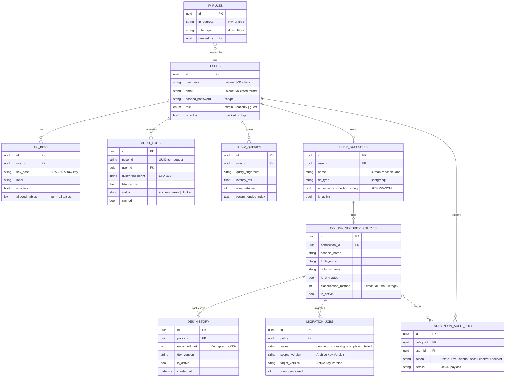

# Data Models — Persistent Storage

## Overview

All PostgreSQL data models used by Argus. Covers user management, API keys, IP rules, multi-DB workbench connections, audit trails, slow query log, and the **Encryption Subsystem**.

**Notes:**
- AI features (NL→SQL, explain, insights, schema chat, anomaly explain) are **stateless** — no DB models needed
- AI rate limiting uses **Redis** only (`argus:ai_ratelimit:{user_id}:{bucket}`)
- Multi-DB workbench adds `user_databases`.
- Envelope encryption adds `column_security_policies`, `dek_history`, `migration_jobs`, and `encryption_audit_logs`.

---

```mermaid
erDiagram
    USERS {
        uuid id PK
        string username "unique, 3-32 chars"
        string email "unique, validated format"
        string hashed_password "bcrypt"
        enum role "admin | readonly | guest"
        bool is_active "checked on login"
    }

    API_KEYS {
        uuid id PK
        uuid user_id FK
        string key_hash "SHA-256 of raw key"
        string label
        bool is_active
        json allowed_tables "null = all tables"
    }

    IP_RULES {
        uuid id PK
        string ip_address "IPv4 or IPv6"
        string rule_type "allow | block"
        uuid created_by FK
    }

    AUDIT_LOGS {
        uuid id PK
        string trace_id "UUID per request"
        uuid user_id FK
        string query_fingerprint "SHA-256"
        float latency_ms
        string status "success | error | blocked"
        bool cached
    }

    SLOW_QUERIES {
        uuid id PK
        uuid user_id FK
        string query_fingerprint
        float latency_ms
        int rows_returned
        text recommended_index
    }

    USER_DATABASES {
        uuid id PK
        uuid user_id FK
        string name "human-readable label"
        string db_type "postgresql"
        text encrypted_connection_string "AES-256-GCM"
        bool is_active
    }

    COLUMN_SECURITY_POLICIES {
        uuid id PK
        uuid connection_id FK
        string schema_name
        string table_name
        string column_name
        bool is_encrypted
        int classification_method "1=manual, 2=ai, 3=regex"
        bool is_active
    }

    DEK_HISTORY {
        uuid id PK
        uuid policy_id FK
        text encrypted_dek "Encrypted by KEK"
        string dek_version
        bool is_active
        datetime created_at
    }

    MIGRATION_JOBS {
        uuid id PK
        uuid policy_id FK
        string status "pending | processing | completed | failed"
        string source_version "Archive Key Version"
        string target_version "Active Key Version"
        int rows_processed
    }

    ENCRYPTION_AUDIT_LOGS {
        uuid id PK
        uuid policy_id FK
        uuid user_id FK
        string action "rotate_key | manual_scan | encrypt | decrypt"
        string details "JSON payload"
    }

    USERS ||--o{ API_KEYS : "has"
    USERS ||--o{ AUDIT_LOGS : "generates"
    USERS ||--o{ SLOW_QUERIES : "causes"
    USERS ||--o{ USER_DATABASES : "owns"
    IP_RULES }o--|| USERS : "created_by"
    
    USER_DATABASES ||--o{ COLUMN_SECURITY_POLICIES : "has"
    COLUMN_SECURITY_POLICIES ||--o{ DEK_HISTORY : "tracks keys"
    COLUMN_SECURITY_POLICIES ||--o{ MIGRATION_JOBS : "migrates"
    COLUMN_SECURITY_POLICIES ||--o{ ENCRYPTION_AUDIT_LOGS : "audits"
    USERS ||--o{ ENCRYPTION_AUDIT_LOGS : "triggers"
```

---

## Redis Keys (Non-Persistent / Cache)

| Key Pattern | Type | Purpose | TTL |
|-------------|------|---------|-----|
| `argus:cache:{conn_scope}:{fp}:{role}` | string | Query result cache | 3600s |
| `argus:cache_tags:{conn_scope}:{table}` | set | Cache tag → fingerprints | None |
| `argus:intelligence:{conn_id}:{schema_hash}` | json | AI Schema Intelligence cache | 86400s |
| `argus:ratelimit:{user_id}:{bucket}` | int | Per-role sliding window rate limit | 120s |
| `argus:ai_ratelimit:{user_id}:{bucket}` | int | AI-specific rate limit (20/min) | 120s |
| `argus:brute:{ip}:{username}` | int | Failed login counter | 15 min |
| `argus:lockout:{ip}` | string | Brute force lockout flag | 15 min |
| `argus:circuit:{label}` | string | Circuit breaker state | varies |
| `argus:metrics:*` | int/float | Latency, cache hits, errors, RPM | none |
| `argus:heatmap` | sorted set | Table access frequency (ZINCRBY) | none |
| `argus:dek:{policy_id}:{version}` | string | In-memory Unwrapped DEK Cache | 900s |

---

_Last Updated: July 2026_
