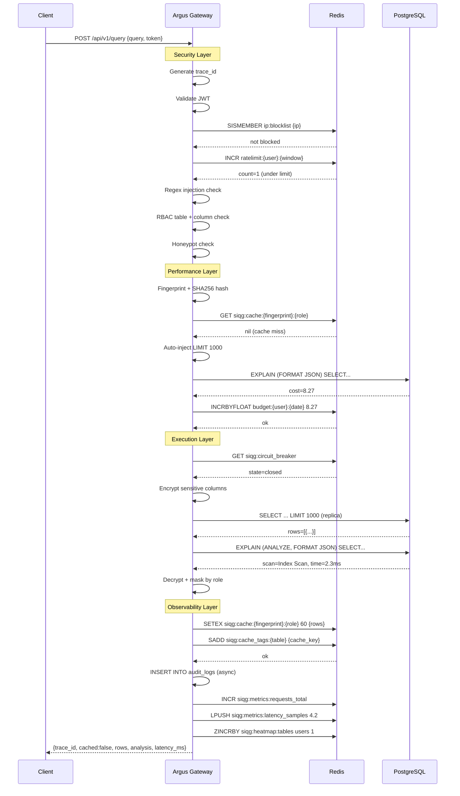

```mermaid
sequenceDiagram
    participant C as Client
    participant G as Argus Gateway
    participant R as Redis
    participant PG as PostgreSQL

    C->>G: POST /api/v1/query {query, token}

    Note over G: Security Layer
    G->>G: Generate trace_id
    G->>G: Validate JWT
    G->>R: SISMEMBER ip:blocklist {ip}
    R-->>G: not blocked
    G->>R: INCR ratelimit:{user}:{window}
    R-->>G: count=1 (under limit)
    G->>G: Regex injection check
    G->>G: RBAC table + column check
    G->>G: Honeypot check

    Note over G: Performance Layer
    G->>G: Fingerprint + SHA256 hash
    G->>R: GET siqg:cache:{fingerprint}:{role}
    R-->>G: nil (cache miss)
    G->>G: Auto-inject LIMIT 1000
    G->>PG: EXPLAIN (FORMAT JSON) SELECT...
    PG-->>G: cost=8.27
    G->>R: INCRBYFLOAT budget:{user}:{date} 8.27
    R-->>G: ok

    Note over G: Execution Layer
    G->>R: GET siqg:circuit_breaker
    R-->>G: state=closed
    G->>G: Encrypt sensitive columns
    G->>PG: SELECT ... LIMIT 1000 (replica)
    PG-->>G: rows=[{...}]
    G->>PG: EXPLAIN (ANALYZE, FORMAT JSON) SELECT...
    PG-->>G: scan=Index Scan, time=2.3ms
    G->>G: Decrypt + mask by role

    Note over G: Observability Layer
    G->>R: SETEX siqg:cache:{fingerprint}:{role} 60 {rows}
    G->>R: SADD siqg:cache_tags:{table} {cache_key}
    R-->>G: ok
    G->>G: INSERT INTO audit_logs (async)
    G->>R: INCR siqg:metrics:requests_total
    G->>R: LPUSH siqg:metrics:latency_samples 4.2
    G->>R: ZINCRBY siqg:heatmap:tables users 1

    G-->>C: {trace_id, cached:false, rows, analysis, latency_ms}
```