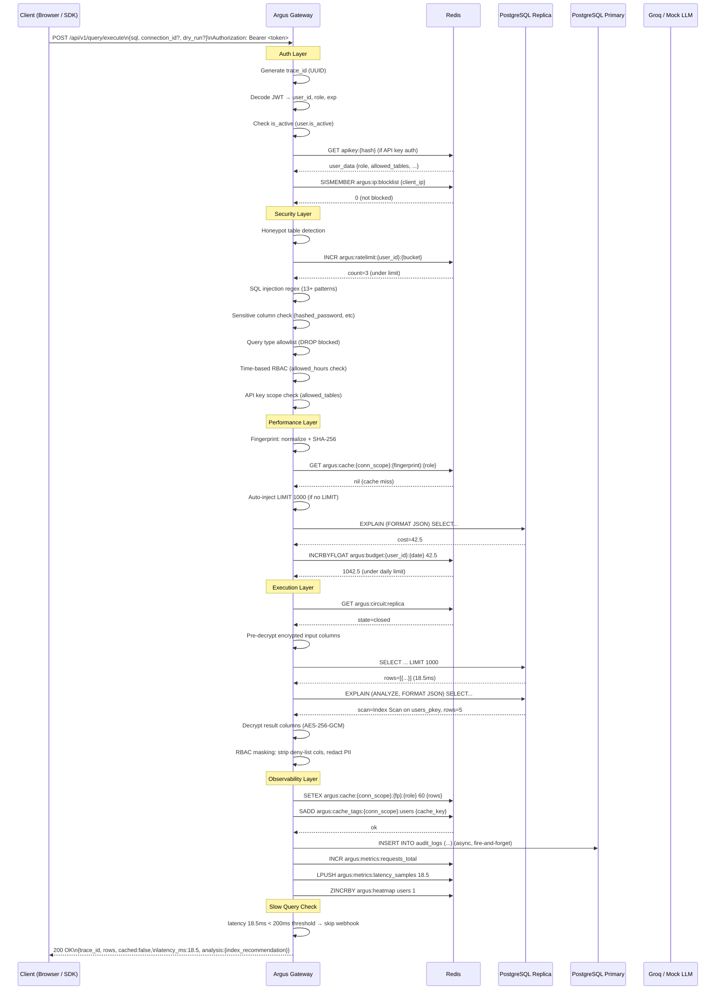
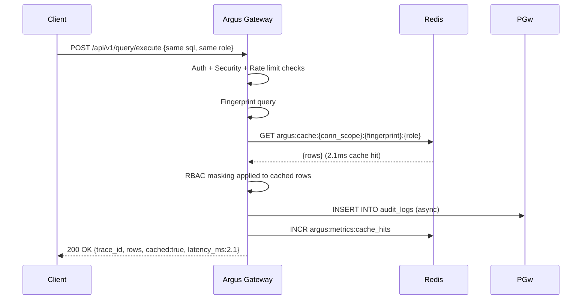
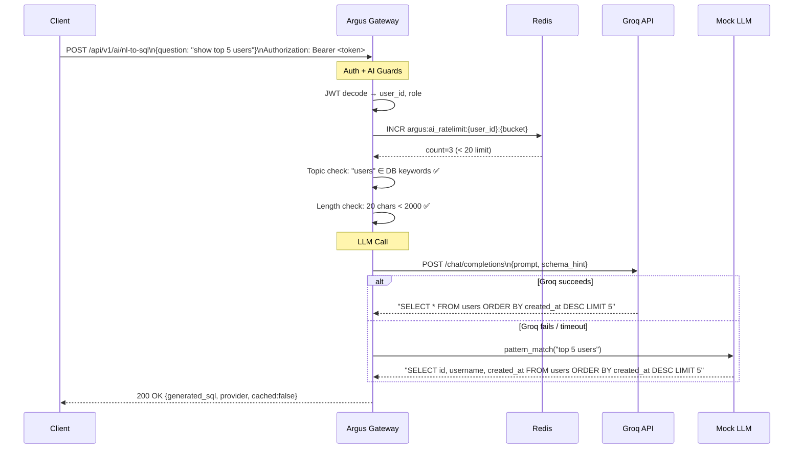
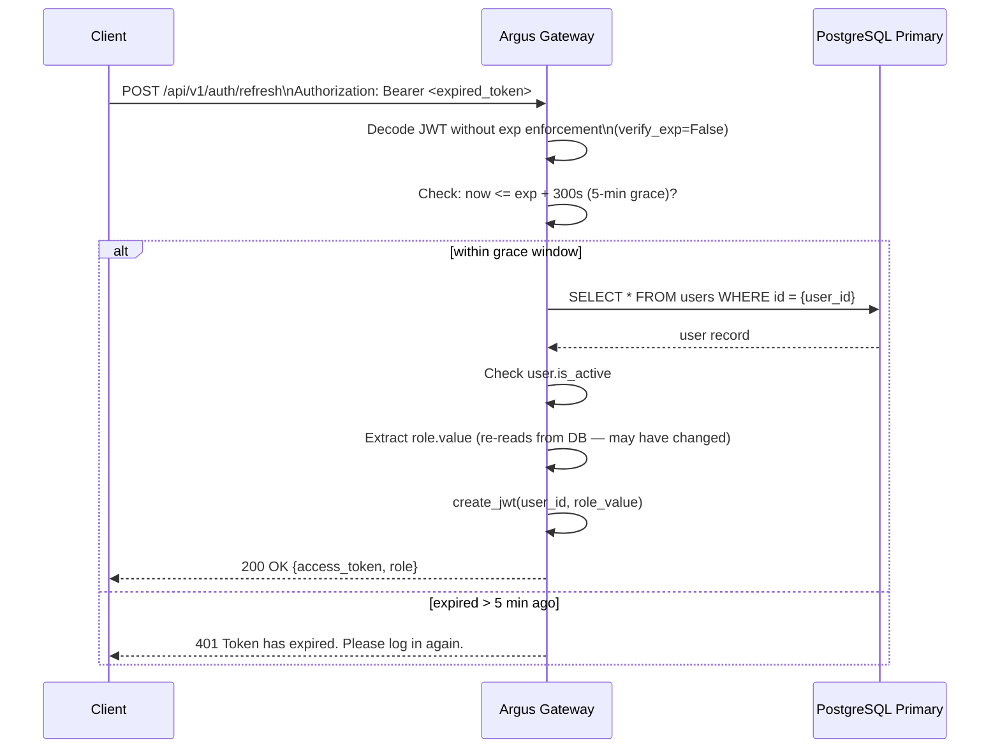

# Request Sequence Diagram — Query Execution (All Phases)

## Overview

Detailed step-by-step sequence for a single query request going through the entire gateway pipeline (cache miss path). Shows both the gateway-internal logic and the Redis/PostgreSQL calls.

**Scope:** Standard query with no cache hit, no dry-run, no external connection. AI endpoint sequence shown separately below.

---

## Standard Query Execution (Cache Miss)

---

## Cache Hit Path (Fast)

---

## AI Endpoint Sequence

---

## Token Refresh Sequence

---

_Last Updated: June 2026_
