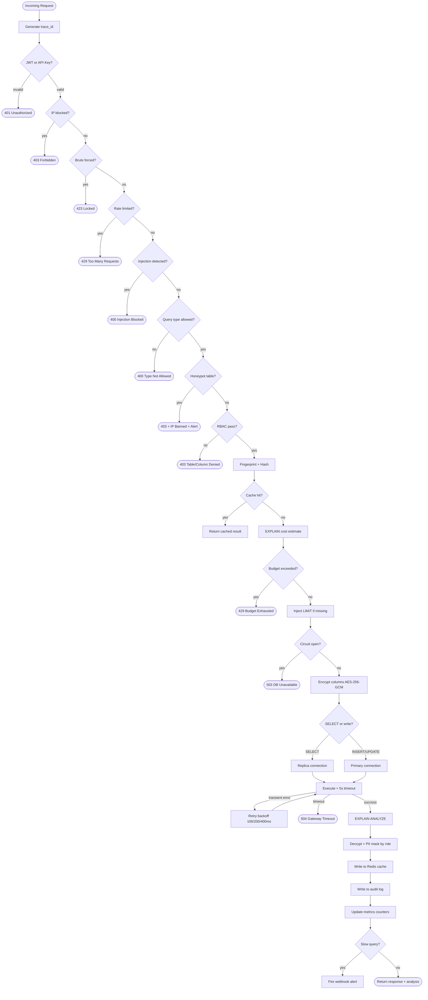

# Request Pipeline — Standard Query Flow (Phase 1-5)

## Overview
Complete flow of a standard query request through all security, performance, execution, and observability layers.

**Scope:** This diagram shows the core pipeline for `/api/v1/query` endpoint.

**Phase 6 Addition:** AI endpoints (`/api/v1/ai/nl-to-sql`, `/api/v1/ai/explain`) have separate pipelines — see [systemarchitecture.md](systemarchitecture.md) for AI layer components.

---

