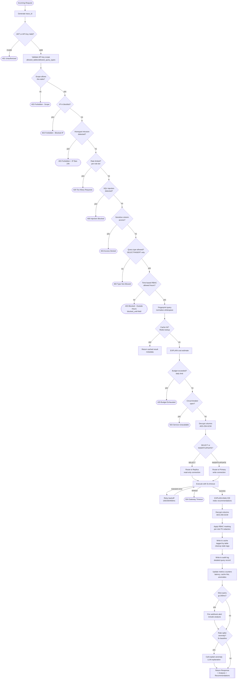

# Request Pipeline — Complete Query Flow (All 32 Steps)

## Overview

Complete flow of a query request through ALL security, performance, execution, observability, hardening, and AI layers (Tiers 1-6, Steps 1-32).

**Scope:** This diagram shows the complete pipeline for `/api/v1/query/execute` endpoint including all new Tier 6 polish features.

**Related:** AI endpoints (`/api/v1/ai/nl-to-sql`, `/api/v1/ai/explain`, `/api/v1/ai/explain-anomaly`) have parallel pipelines — see [systemarchitecture.md](systemarchitecture.md) for integrated architecture.

---

## Complete Request Pipeline (11+ Stages)

