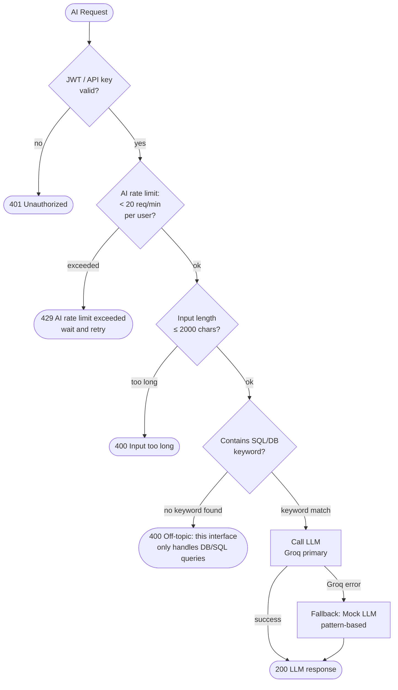

# Request Pipeline — Complete Query Flow

## Overview

Complete flow of a request through ALL security, performance, execution, observability, and AI layers.

**Scope:** This diagram shows the full pipeline for `/api/v1/query/execute`.  
AI endpoints (`/ai/nl-to-sql`, `/ai/explain`, `/ai/insights`, `/ai/explain-anomaly`, `/ai/schema-chat`) have a separate guard pipeline shown at the bottom.

---

## Query Execution Pipeline

```mermaid
flowchart TD
    A([Incoming Request]) --> B[Generate trace_id]

    %% Auth
    B --> C{JWT or API Key?}
    C -->|missing| C0([401 No credentials])
    C -->|JWT| C1{Signature valid\nand not expired\n+5-min grace?}
    C1 -->|invalid| C2([401 Invalid token])
    C1 -->|valid| C3{is_active?}
    C3 -->|false| C4([403 Account disabled])
    C3 -->|true| D
    C -->|API Key| CK{Hash in Redis\nor DB?}
    CK -->|invalid| CK1([401 Invalid API key])
    CK -->|valid + active| D

    %% API Key Scope
    D[Extract user_id, role, scope] --> D1{API key scope:\ntable allowed?}
    D1 -->|no| D2([403 Scope violation])
    D1 -->|yes / JWT| E

    %% IP + Honeypot
    E{IP blocklisted?} -->|yes| E1([403 Blocked IP])
    E -->|no| F{Honeypot table\naccessed?}
    F -->|yes| F1([403 + Auto-ban 24h])
    F -->|no| G

    %% Rate limit
    G{Rate limited?\nper-role sliding window} -->|yes| G1([429 Too Many Requests\nX-RateLimit-Reset header])
    G -->|no| H

    %% SQL validation
    H{SQL Injection\ndetected?} -->|yes| H1([400 Injection blocked])
    H -->|no| I{Sensitive column\nin query?} 
    I -->|yes| I1([403 Access denied])
    I -->|no| J{Query type\nDROP/EXEC etc?}
    J -->|blocked| J1([400 Type not allowed])
    J -->|allowed| K

    %% Time-based RBAC
    K{Time-based RBAC:\nwithin allowed_hours?} -->|no| K1([403 Outside hours\nblocked_until field])
    K -->|yes| L

    %% Fingerprint + Cache
    L[Fingerprint query\nnormalize + SHA-256 + role] --> M{Cache hit?\nRedis role-scoped GET}
    M -->|hit| M1[Return cached result\n+cache_hit metadata]

    %% Cost + Budget
    M -->|miss| N[EXPLAIN cost estimate]
    N --> O{Daily budget\nexceeded?}
    O -->|yes| O1([429 Budget exhausted])
    O -->|no| P

    %% Dry-run
    P{Dry-run mode?} -->|yes| P1([200 Dry-run preview\nno execution])
    P -->|no| Q

    %% Circuit breaker
    Q{Circuit breaker\nopen?} -->|yes| Q1([503 Service unavailable])
    Q -->|closed| R

    %% Decrypt + Route
    R[Pre-decrypt\nencrypted columns] --> S{SELECT or\nINSERT/UPDATE?}
    S -->|SELECT| S1[Replica connection\nread-only pool]
    S -->|write| S2[Primary connection\nwrite pool]
    S -->|connection_id| S3[External DB\nper-user connection]
    S1 --> T[Execute with\n5s timeout]
    S2 --> T
    S3 --> T
    T -->|transient error| T1[Retry: 100/200/400ms\nexponential backoff]
    T1 --> T
    T -->|timeout| T2([504 Gateway timeout])
    T -->|success| U

    %% Post-execution
    U[EXPLAIN ANALYZE\nindex recommendations] --> V
    V[Decrypt result columns\nAES-256-GCM] --> W
    W[RBAC masking\ncolumn deny-list + PII redaction] --> X

    %% Cache write + observability
    X[Write to Redis cache\ntagged by table\nSSCAN stale cleanup] --> Y
    Y[Async audit log write\ntrace_id, user, fp, latency] --> Z
    Z[Redis metrics update\nlatency, cache, RPM, heatmap] --> AA

    %% Alerting
    AA{Slow query?\n> SLOW_THRESHOLD ms} -->|yes| AA1[Fire webhook alert\nSlack/Discord]
    AA1 --> AB{Rate spike\nanomaly?\n3× baseline}
    AA -->|no| AB
    AB -->|yes| AB1[Call /ai/explain-anomaly\nLLM severity + analysis]
    AB1 --> AC
    AB -->|no| AC

    AC[[Return Response\n{rows, meta, recommendations,\ntrace_id, cached, latency_ms}]]
```

---

## AI Endpoint Guard Pipeline

All 5 AI endpoints (`/ai/nl-to-sql`, `/ai/explain`, `/ai/insights`, `/ai/explain-anomaly`, `/ai/schema-chat`) share this guard pipeline **before** calling the LLM:

```mermaid
flowchart TD
    A1([AI Request]) --> B1{JWT / API key\nvalid?}
    B1 -->|no| B2([401 Unauthorized])
    B1 -->|yes| C1

    C1{AI rate limit:\n< 20 req/min\nper user?} -->|exceeded| C2([429 AI rate limit exceeded\nwait and retry])
    C1 -->|ok| D1

    D1{Input length\n≤ 2000 chars?} -->|too long| D2([400 Input too long])
    D1 -->|ok| E1

    E1{Contains SQL/DB\nkeyword?} -->|no keyword found| E2([400 Off-topic: this interface\nonly handles DB/SQL queries])
    E1 -->|keyword match| F1

    F1[Call LLM\nGroq primary]
    F1 -->|success| G1([200 LLM response])
    F1 -->|Groq error| H1[Fallback: Mock LLM\npattern-based]
    H1 --> G1
```

---

## Key Limits Reference

| Gate | Limit | Response |
|------|-------|----------|
| Brute force | 5 failed logins → 15-min lockout | 429 |
| Rate limit — guest | 10 req/min | 429 |
| Rate limit — readonly | 60 req/min | 429 |
| Rate limit — admin | 500 req/min | 429 |
| AI rate limit (all roles) | 20 req/min | 429 |
| AI input length | 2000 chars | 400 |
| Query execution timeout | 5 seconds | 504 |
| Cost threshold warn | 1000 units | logged |
| Cost threshold block | 10000 units | 429 |
| Auto LIMIT injection | 1000 rows | transparent |

