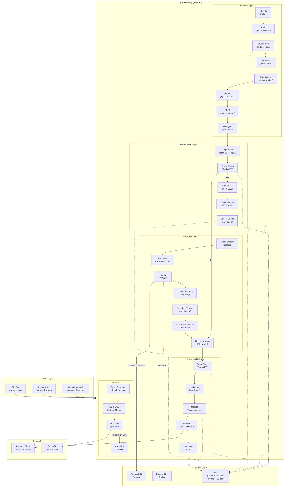

# System Architecture — Complete (Phase 1-6)

## Overview

Argus 6-layer pipeline with all middleware stacks integrated. Includes Phase 6 AI layer endpoints.

**Layers:**

- Layer 1: Security (Auth, Brute Force, RBAC, Honeypot)
- Layer 2: Performance (Cache, Cost Estimation, Budget)
- Layer 3: Execution (Circuit Breaker, Encryption, Routing)
- Layer 4: Observability (Audit, Metrics, Webhooks)
- Layer 5: Security Hardening (implied in encryption/masking)
- Layer 6: AI (NL→SQL, Query Explainer)

---

