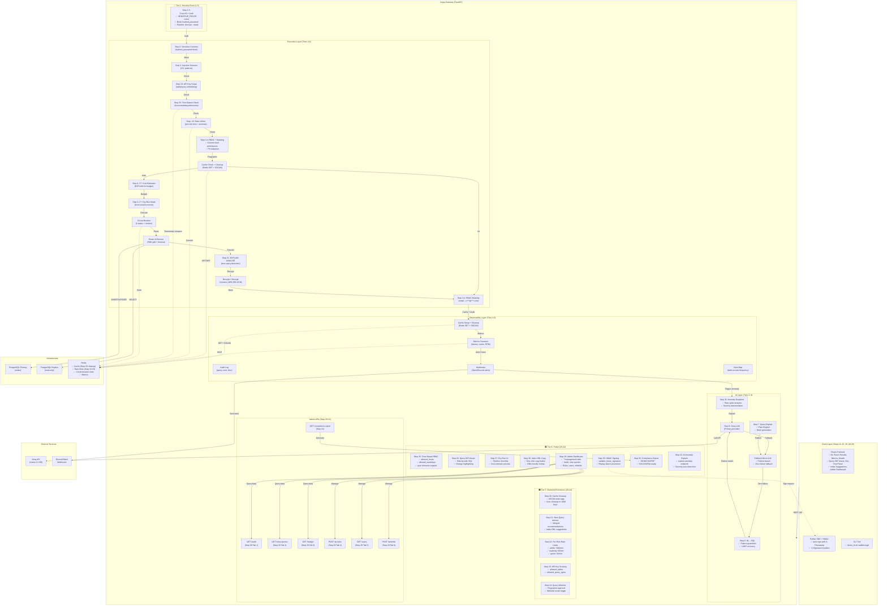

# rgus System Architecture — Complete (Tiers 1-6, All 32 Steps)

## Overview

Argus complete 6-layer pipeline with all middleware, security hardening, polish features, and AI integration. Covers all 32 integration steps across Tiers 1-6.

**Tiers:**

- **Tier 1** (Steps 1-5): Security Fixes - Sensitive fields centralization, RBAC masking, pipeline order
- **Tier 2** (Steps 6-10): AI Reliability - NL→SQL quality, explanations, fallbacks, dry-run
- **Tier 3** (Steps 11-15): Frontend Build - React app, dashboards, visualizations
- **Tier 4** (Steps 16-19): Proof & Credibility - CI/CD, load testing, documentation
- **Tier 5** (Steps 20-24): Backend Extensions - Cache cleanup, slow query advisor, per-role rate limits, API scoping, whitelisting
- **Tier 6** (Steps 25-32): Polish - Time-based RBAC, query diff, dry-run UI, DDL copy, admin dashboard, HMAC signing, compliance reports, anomaly explanations

---



---

## Component Mapping to Steps

| Step  | Component                       | Details                                                                                                |
| ----- | ------------------------------- | ------------------------------------------------------------------------------------------------------ |
| 1-5   | Security fixes, pipeline order  | Centralized SENSITIVE_FIELDS, RBAC masking, decrypt→mask order                                         |
| 6-10  | AI reliability, NL→SQL, explain | Pattern matching, Groq fallback, mock LLM, dry-run                                                     |
| 11-15 | React frontend                  | Dashboard, metrics, health, results table, NL panel                                                    |
| 16-19 | CI/CD, testing, demo            | GitHub Actions, load tests, SDK CLI, README metrics                                                    |
| 20-24 | Backend extensions              | Cache cleanup (SSCAN), slow query advisor, per-role limits, API scoping, whitelisting                  |
| 25-32 | Polish features                 | Time-based RBAC, diff viewer, dry-run UI, DDL copy, admin dashboard, HMAC, compliance, anomaly explain |

---

## Data Flow Example: Complete Query Journey (All Tiers)

```
User enters English question:
"Show top 5 users created last week"
            ↓
[Tier 2, Step 6] NL→SQL (Groq/Mock)
"SELECT * FROM users WHERE created_at >= NOW() - INTERVAL '7 days' LIMIT 5"
            ↓
[Tier 1, Step 2] Injection detection ✅ Safe
            ↓
[Tier 1, Step 2] Sensitive column check ✅ No hashed_password
            ↓
[Tier 1, Step 4] RBAC check ✅ Readonly role can access users
            ↓
[Tier 5, Step 22] Rate limit check (readonly = 60/min) ✅ Within limit
            ↓
[Tier 6, Step 25] Time-based check (readonly 9-5 EST) ✅ During work hours
            ↓
[Tier 5, Step 23] API key scope check ✅ users table allowed
            ↓
[Tier 2, Step 9 / Tier 6, Step 27] Dry-run mode? ← User can preview here
            ↓
[Tier 2, Step 9] Cost estimation (EXPLAIN) = 42.5 units ✅ Budget available
            ↓
[Tier 5, Step 20] Cache check (fingerprint) ✅ Hit! Return instantly (2.1ms)
            ↓
[Tier 1, Step 4] RBAC masking (email→u***@***.com) ✅ PII masked
            ↓
[Tier 5, Step 20] Cache cleanup (if >1000 tags) ← Auto SSCAN
            ↓
[Tier 4] Audit log entry ← What query, who, when
            ↓
[Tier 4] Metrics update ← latency, cache hit, cost
            ↓
[Tier 6, Step 26] Show query diff (← Original vs Argus version)
            ↓
[Tier 6, Step 31] Compliance record ← PII masked, success logged
            ↓
Return: 5 rows, 2.1ms, cached ✅ 8.8× faster than first run!
```

---

## All 32 Steps at a Glance

✅ All 32 steps complete and integrated into production gateway:

- Tier 1-5: Core security, performance, intelligence
- Tier 6: Enterprise polish, compliance, observability
