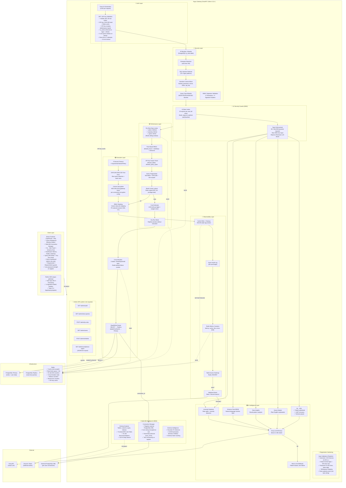

# Argus System Architecture — Complete (Tiers 1-6 + Security Hardening)

## Overview

Argus is a **production-grade SQL intelligence gateway** with a complete 6-layer pipeline covering security, performance, execution, observability, hardening, and AI.

**What's new since initial implementation:**
- **Multi-database workbench** — users register external PostgreSQL connections; queries routed per `connection_id`
- **AI security guards** — per-user rate limit (20/min) + SQL/DB topic enforcement on all 5 AI endpoints
- **Auth hardening** — Pydantic validators on register, `is_active` checks, 5-minute token refresh grace, `RequireAdmin` frontend guard
- **Schema Chat** — new AI endpoint for natural language schema exploration

---


```mermaid
graph TB
    subgraph CLIENT["Client Layer"]
        UI["React Frontend (TypeScript + Vite)\n✅ Query Workbench (Monaco Editor)\n✅ Multi-DB Connection Manager\n✅ NL→SQL Panel + Schema Chat\n✅ Dashboard: Metrics, Health, Heatmap\n✅ Query Diff Viewer + Dry-Run Panel\n✅ Admin Dashboard (admin role only)\n✅ RequireAuth + RequireAdmin guards\n✅ Live password strength on register"]
        SDK["Python SDK (argus-gateway)\n✅ Auto-sign with X-Timestamp\n✅ X-Signature HMAC headers\n✅ Typer CLI (login/query/explain)"]
    end

    subgraph GATEWAY["Argus Gateway (FastAPI, Python 3.11+)"]

        subgraph AUTH_LAYER["🔐 Auth Layer"]
            TRACE["Trace ID Generation\n(UUID per request)"]
            JWT_CHECK["JWT / API Key Validation\n✅ HS256 JWT, 60-min expiry\n✅ API key: SHA-256 hash + Redis cache\n✅ API key scoping (tables/query types)\n✅ is_active enforced on login + refresh\n✅ 5-min grace window on refresh\n✅ Brute force: 5 attempts → 15-min lockout"]
        end

        subgraph REGISTER["🔏 Registration Hardening"]
            REG_VAL["Input Validation (Pydantic)\n✅ Username: 3-32 chars [a-zA-Z0-9_-]\n✅ Email: format regex + 254-char max\n✅ Password: 8-128 chars, letter+digit\n✅ Whitespace stripping\n✅ Role.readonly enum (not bare string)"]
        end

        subgraph SEC["🔴 Security Layer"]
            IP_CHECK["IP Blocklist / Allowlist\n(PostgreSQL ip_rules table)"]
            HONEYPOT["Honeypot Detection\n(auto-ban 24h)"]
            INJECT["SQL Injection Detector\n(13+ regex patterns)"]
            SENSITIVE["Sensitive Column Block\nhashed_password, secret, token, api_key"]
            TYPE_CHECK["Query Type Allowlist\nDROP/TRUNCATE/EXEC blocked"]
            HMAC_VAL["HMAC Signature Validation\nX-Timestamp + X-Signature headers"]
        end

        subgraph AI_GUARD["🤖 AI Security Guards (NEW)"]
            AI_RATE["AI Rate Limiter\n20 req/min per user (all roles)\nRedis: argus:ai_ratelimit:{uid}:{bucket}"]
            AI_TOPIC["Topic Enforcement\n60+ SQL/DB keywords required\nMax 2000 char input\nRejects off-domain LLM abuse"]
        end

        subgraph PERF["🟡 Performance Layer"]
            RATE["Per-Role Rate Limiter\n✅ admin: 500/min\n✅ readonly: 60/min\n✅ guest: 10/min\n(Redis sliding window)"]
            TIME_RBAC["Time-Based RBAC\nallowed_hours + weekdays + timezone"]
            SCOPE["API Key Scope Check\nallowed_tables, allowed_query_types"]
            FINGERPRINT["Query Fingerprinter\nNormalize + SHA-256 + role-scoped"]
            CACHE_GET["Redis Cache Lookup\nRole-scoped GET (no privilege leak)"]
            COST_EST["Cost Estimator\nEXPLAIN pre-flight + budget check"]
            DRY_RUN["Dry-Run Mode\nPipeline preview without execution"]
        end

        subgraph EXEC["🟢 Execution Layer"]
            CB["Circuit Breaker\n3 states: closed/open/half-open\nRedis-backed failure counter"]
            RW_ROUTE["Read/Write Router\nSELECT → Replica\nINSERT/UPDATE → Primary"]
            TIMEOUT["5-Second Timeout\n+ Exponential Backoff Retry"]
            EXPLAIN_POST["EXPLAIN ANALYZE Post-Exec\nSlow query detection + index hints"]
            DECRYPT["Column Decryption\nAES-256-GCM (gateway keys)\nper-connection encryption config"]
            MASK["RBAC Masking\nColumn deny-list stripping\nPII redaction (email, SSN, CC)"]
        end

        subgraph MULTI_DB["🔵 Multi-DB Workbench (NEW)"]
            CONN_MGR["Connection Manager\n✅ Register external PostgreSQL DBs\n✅ Conn string encrypted at rest\n✅ Ownership enforced (user_id FK)\n✅ Test connectivity on register"]
            SCHEMA_EXPLR["Schema Explorer\nTables, columns, types, indexes\n✅ Frontend BFS Join Paths\n✅ AI Join Recommendations\n✅ Ctrl+K Deep Search"]
            SCHEMA_INTEL["Schema Intelligence\n✅ Heuristic FK Inference\n✅ AI DB Summaries (Domain, Entities)\n✅ Schema Hash Caching"]
        end

        subgraph OBS["🔵 Observability Layer"]
            AUDIT["Async Audit Log\n(fire-and-forget)"]
            METRICS["Redis Metrics Counters\nlatency, cache_hits, errors, RPM"]
            HEATMAP["Table Access Heatmap\nRedis ZINCRBY"]
            WEBHOOK["Webhook Alerts\nSlack / Discord (async)"]
            CACHE_WRITE["Cache Write + Cleanup\nSSCAN stale tag eviction"]
        end

        subgraph AI_LAYER["🟣 AI Intelligence Layer"]
            NL_SQL["NL→SQL\n✅ Pattern guardrails\n✅ LIMIT accuracy\n✅ Schema-aware"]
            EXPLAIN_AI["Query Explain\nPlain English explanation"]
            INSIGHTS["Data Insights\nResult pattern analysis"]
            SCHEMA_CHAT["Schema Chat (NEW)\nNatural language schema Q&A"]
            ANOMALY_AI["Anomaly Explainer\nRate spike + severity detection"]
            GROQ["Groq LLM (Primary)\nllama-3.1-8b-instant"]
            MOCK_LLM["Mock LLM (Fallback)\nPattern-based, zero-failure"]
        end

        subgraph ADMIN_API["🔑 Admin APIs (admin role required)"]
            AUDIT_API["GET /admin/audit"]
            SLOW_API["GET /admin/slow-queries"]
            IP_API["POST /admin/ip-rules"]
            USER_API["GET /admin/users"]
            WHITELIST_API["POST /admin/whitelist"]
            COMPLIANCE_API["GET /admin/compliance-report\n(JSON/CSV export)"]
        end
    end

    subgraph INFRA["Infrastructure"]
        PG_PRIMARY["PostgreSQL Primary\n(writes + user data)"]
        PG_REPLICA["PostgreSQL Replica\n(read-only queries)"]
        REDIS_DB["Redis\n✅ Cache (role-scoped)\n✅ Rate limits (query + AI)\n✅ AI rate limit counters\n✅ Circuit breaker state\n✅ Metrics counters\n✅ Brute force counters\n✅ API key cache"]
    end

    subgraph EXTERNAL["External"]
        GROQ_API["Groq API\n(cloud LLM)"]
        DISCORD["Discord / Slack\n(webhook alerts)"]
        EXT_DBS["External PostgreSQL DBs\n(per-user connections)"]
    end

    CLIENT -->|HTTPS REST| GATEWAY

    TRACE --> JWT_CHECK
    JWT_CHECK --> IP_CHECK
    IP_CHECK --> HONEYPOT
    HONEYPOT --> INJECT
    INJECT --> SENSITIVE
    SENSITIVE --> TYPE_CHECK
    TYPE_CHECK --> AI_GUARD
    AI_GUARD --> RATE
    RATE --> TIME_RBAC
    TIME_RBAC --> SCOPE
    SCOPE --> FINGERPRINT
    FINGERPRINT --> CACHE_GET
    CACHE_GET -->|hit| MASK
    CACHE_GET -->|miss| COST_EST
    COST_EST --> DRY_RUN
    DRY_RUN --> CB
    CB --> RW_ROUTE
    RW_ROUTE -->|SELECT| PG_REPLICA
    RW_ROUTE -->|INSERT/UPDATE| PG_PRIMARY
    RW_ROUTE -->|connection_id| CONN_MGR
    CONN_MGR --> EXT_DBS
    TIMEOUT --> EXPLAIN_POST
    EXPLAIN_POST --> DECRYPT
    DECRYPT --> MASK
    MASK --> CACHE_WRITE
    CACHE_WRITE --> AUDIT
    AUDIT --> METRICS
    METRICS --> HEATMAP
    HEATMAP -->|slow?| WEBHOOK
    WEBHOOK -->|anomaly?| ANOMALY_AI

    AI_RATE --> AI_TOPIC
    AI_TOPIC --> NL_SQL
    AI_TOPIC --> EXPLAIN_AI
    AI_TOPIC --> INSIGHTS
    AI_TOPIC --> SCHEMA_CHAT
    AI_TOPIC --> ANOMALY_AI

    NL_SQL --> GROQ
    EXPLAIN_AI --> GROQ
    INSIGHTS --> GROQ
    SCHEMA_CHAT --> GROQ
    ANOMALY_AI --> GROQ
    GROQ -->|fail| MOCK_LLM
    GROQ --> GROQ_API

    WEBHOOK --> DISCORD

    CACHE_WRITE -.->|SET/GET/SSCAN| REDIS_DB
    RATE -.->|INCR| REDIS_DB
    AI_RATE -.->|INCR| REDIS_DB
    CB -.->|state| REDIS_DB
    METRICS -.->|INCR| REDIS_DB
    JWT_CHECK -.->|API key cache| REDIS_DB

    ADMIN_API -.->|queries| PG_PRIMARY
    SCHEMA_EXPLR -.->|introspect| EXT_DBS
```

---

## Component → Endpoint Mapping

| Component | Endpoints |
|-----------|-----------|
| Auth Layer | `POST /auth/login`, `POST /auth/register`, `POST /auth/refresh` |
| Query Execution | `POST /query/execute`, `POST /query/dry-run`, `GET /query/budget`, `GET /query/history` |
| AI (all guarded) | `POST /ai/nl-to-sql`, `/ai/explain`, `/ai/insights`, `/ai/explain-anomaly`, `/ai/schema-chat` |
| Multi-DB | `GET/POST/DELETE /connections`, `POST /connections/{id}/test`, `GET /connections/{id}/schema`, `POST /connections/{id}/intelligence` |
| Observability | `GET /metrics/live`, `GET /metrics/heatmap` |
| Admin | `GET /admin/audit`, `/admin/slow-queries`, `/admin/ip-rules`, `/admin/users`, `/admin/whitelist`, `/admin/compliance-report` |
| System | `GET /health`, `GET /api/v1/status` |

---

## Data Flow: Complete Query Journey

```
User: "Show top 5 users created last week"
         ↓
[Auth] JWT validated, user_id + role extracted
         ↓
[AI Guard] Rate check (< 20/min) + topic check ("users" = DB keyword) ✅
         ↓
[NL→SQL] Pattern match → "SELECT * FROM users ORDER BY created_at DESC LIMIT 5"
         ↓
[Security] Injection check ✅ | Sensitive col check ✅ | Type: SELECT ✅
         ↓
[Rate Limit] readonly role → 60/min check ✅
         ↓
[Time RBAC] Within allowed_hours ✅
         ↓
[Cache] Fingerprint → Redis GET → miss
         ↓
[Cost] EXPLAIN → 42.5 units → budget 49,957 remaining ✅
         ↓
[Circuit Breaker] State: closed ✅
         ↓
[Execute] Route to PG Replica → 18.5ms → 5 rows returned
         ↓
[EXPLAIN ANALYZE] → seq scan on users, recommends index on created_at
         ↓
[Decrypt] No encrypted columns in this query
         ↓
[RBAC Mask] email → u***@***.com, hashed_password stripped
         ↓
[Cache Write] SET with 60s TTL, table tag "users"
         ↓
[Audit] Async write: trace_id, user, query_fp, 18.5ms, cached=false
         ↓
[Metrics] latency_ms INCR, cache_miss INCR, heat_map ZINCRBY "users"
         ↓
Response: 5 rows, 18.5ms, index recommendation included ✅
```

---

_Last Updated: June 2026_
